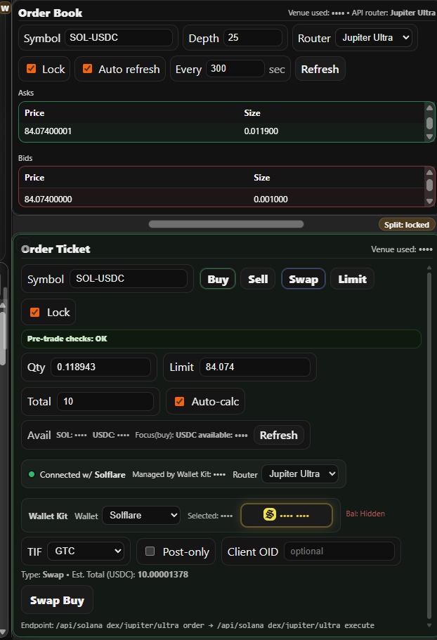
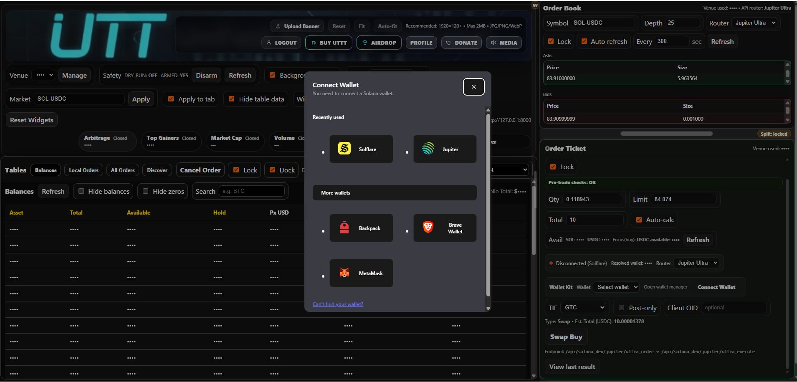
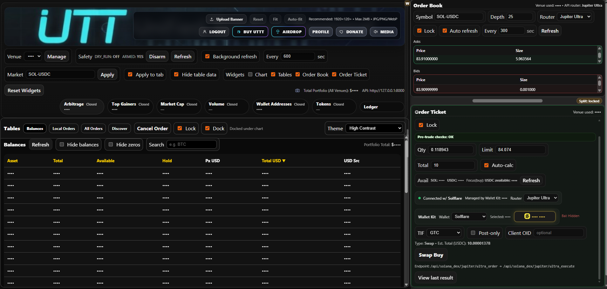
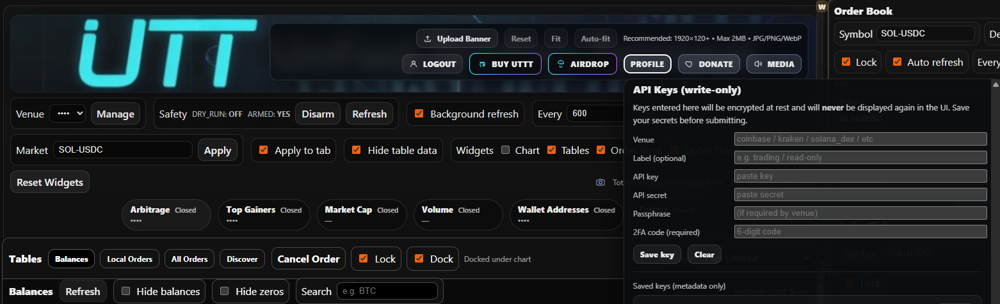

# UTT — Unified Trading Terminal

UTT (Unified Trading Terminal) is a local-first, multi-venue crypto trading terminal built with **FastAPI** on the backend and **React** on the frontend. It is designed to unify centralized exchange (CEX) workflows and selected decentralized exchange (DEX) flows under a single operator-focused interface.

At a high level, UTT provides one place to:

- connect and manage venue credentials
- inspect balances and portfolio state
- view orderbooks and pseudo-orderbooks
- submit and track orders across venues
- monitor scanners, discovery tools, and wallet activity
- work with local ledger and tax-related state
- integrate Solana and Polkadot / Hydration DEX routing and wallet-based execution alongside traditional exchange adapters

---

## What UTT is

UTT is a desktop-style browser application today, but architecturally it functions as a local trading workstation:

- **Backend:** FastAPI application providing venue adapters, market/order routes, auth/profile endpoints, wallet and ledger tooling, Solana DEX routing, and Polkadot / Hydration routing
- **Frontend:** React interface providing a modular multi-window trading terminal UI
- **Storage / local state:** local database and runtime state kept outside of public source control
- **Secrets model:** local or external environment loading for runtime config, plus profile-managed encrypted credential storage for exchange API keys

This repository contains the application code, not live credentials, private keys, or production database state.

---

## Major capabilities

### Centralized exchange workflow

UTT includes exchange adapter and routing layers for multiple venues, with a design centered on a unified terminal experience rather than isolated venue-specific apps.

Current functionality in the codebase includes:

- venue registry and adapter routing
- balances and account views
- order submission plumbing
- order status aggregation
- unified all-orders style data views
- auth, profile, and API-key management flows

### Solana DEX workflow

UTT also includes Solana DEX-specific functionality so on-chain trading can live inside the same interface.

Current architecture in this repository includes support for:

- **Jupiter Metis** swap pathing
- **Jupiter Ultra** order and execution flows
- **Jupiter Trigger** limit-order-related flows
- **Raydium** swap routing
- Solana wallet-aware order ticket behavior
- wallet selection and wallet-manager integration in the frontend
- token resolution, mint lookup, token registry support, and balance helpers

### Polkadot / Hydration DEX workflow

UTT includes a Polkadot / Hydration integration path focused on routing UTTT-HDX activity through the same terminal workflow as CEX and Solana DEX activity.

Current architecture in this repository includes support for:

- **Polkadot-Hydration** venue routing
- Hydration RPC access through profile-managed API keys
- Token Registry-managed Hydration asset metadata
- Token Registry-managed external price metadata
- Hydration Route Registry support for manual/live pool routes
- UTTT-HDX manual XYK orderbook generation from live pool reserves
- Hydration order-ticket execution plumbing for UTTT-HDX
- Hydration balances in terminal tables and wallet-address views
- external USD price enrichment for HDX and DOT
- UTTT/USD derivation from UTTT-HDX live route pricing and HDX/USD
- Hydration swap recording into the unified all-orders flow through `swap_orders`

The pre-push safe path avoids generic Hydration SDK quote polling for pricing. Broad SDK router quotes are disabled by default while the UTTT-HDX route uses registry-backed manual/live pool metadata. Future SDK work should use a persistent stateful Hydration SDK cache/service rather than per-pair or per-refresh polling.

### Operator UI / terminal behavior

The frontend is built as a workstation terminal with independently managed panes and specialized windows.

Representative components include:

- `App.jsx` as the primary shell
- `WindowManager.jsx` for pane and window behavior
- `OrderBookWidget.jsx`
- `OrderTicketWidget.jsx`
- `TerminalTablesWidget.jsx`
- feature windows such as token registry and scanner tooling

### Security / operational direction

UTT is intentionally structured so the code can be published while sensitive runtime material stays local.

That includes:

- external env-path loading for runtime configuration
- keeping live backend secrets outside the repo
- avoiding committed database and key files
- using **Profile → API Keys** for venue credentials instead of tracked env files
- storing user-entered venue keys in the app’s local encrypted credential store rather than plaintext repository files

---

## Repository layout

A simplified view of the current repository structure:

```text
.
├── backend/
│   ├── app/
│   │   ├── adapters/
│   │   ├── routers/
│   │   ├── services/
│   │   ├── venues/
│   │   ├── config.py
│   │   ├── main.py
│   │   ├── models.py
│   │   └── schemas.py
│   ├── alembic/
│   ├── data/
│   └── keys/
├── frontend/
│   ├── public/
│   └── src/
│       ├── app/
│       ├── components/
│       ├── features/
│       ├── hooks/
│       ├── lib/
│       ├── utils/
│       ├── App.jsx
│       ├── main.jsx
│       ├── OrderBookWidget.jsx
│       ├── OrderTicketWidget.jsx
│       └── TerminalTablesWidget.jsx
├── docs/
│   └── screenshots/
├── scripts/
├── .env.example
└── .gitignore
```

### Important directories

#### `backend/app/adapters/`
Venue-specific adapter logic and exchange integration helpers.

#### `backend/app/routers/`
FastAPI routers exposing backend functionality to the frontend and local operator workflows.

#### `backend/app/services/`
Shared service-layer logic such as aggregated order handling.

#### `backend/app/venues/`
Venue registration and integration mapping.

#### `frontend/src/`
Main frontend application code, widgets, feature windows, hooks, and supporting libraries.

#### `docs/screenshots/`
Repository screenshots used in this README and on the public repo page.

#### `scripts/`
Utility scripts and local development helpers.

---

## Current frontend focus

The UI is built around a multi-pane trading terminal rather than a static page layout.

Current areas of focus include:

- right-lane tile and splitter behavior
- terminal-style window management
- order book and order ticket integration
- table, ledger, and order views
- Solana wallet-manager integration for DEX flows
- registry and tool windows

In practical terms, the frontend favors:

- task-oriented windows
- local workflow efficiency
- keyboard and mouse hybrid usage
- dense operator information over marketing-style UI

---

## Current backend focus

The backend acts as the local orchestration layer for UTT. It is not just a thin API wrapper.

It is responsible for:

- venue adapter access
- wallet and market routing
- order creation and cancellation support
- unified order views
- token and symbol resolution
- local auth and profile integration
- Solana DEX route construction and transaction preparation
- local environment and secret resolution patterns

The backend is the source of truth for trading-side behavior, while the frontend is the terminal for interacting with it.

---

## Supported and integrated areas in the codebase

The exact state of each venue may evolve over time, but the repository currently includes work across:

- Coinbase
- Crypto.com Exchange
- Dex-Trade
- Gemini
- Kraken
- Robinhood
- Solana DEX flows
  - Jupiter
  - Raydium
- Polkadot / Hydration DEX flows
  - Hydration UTTT-HDX manual/live route
  - Token Registry asset and price metadata
  - Route Registry live pool reserves

Supporting routes and tooling also include:

- auth and profile flows
- token registry
- wallet address handling
- all-orders aggregation
- scanner and discovery windows
- airdrop-related routing and tooling

---

## Screenshots

### Main Trading Terminal


### Order Book and Order Ticket


### Token Registry


### Solana DEX Wallet / Order Ticket


### Tables / Balances View


### Profile / API Keys


---

## Quick start

> **Important:** UTT is designed to run with local configuration and local secrets. Do **not** paste real keys into tracked files. Keep runtime secrets outside the repository.

### Prerequisites

Recommended baseline:

- **Python 3.10+**
- **Node.js 18+** and npm
- Windows PowerShell for the Windows-oriented commands below
- a local Solana wallet extension if using Solana DEX features
- a Polkadot/Substrate wallet extension such as SubWallet if using Polkadot / Hydration flows
- venue access and any required API credentials for the venues you plan to test

### 1) Clone the repository

```powershell
git clone https://github.com/eyemaginative/utt-unified-trading-terminal.git
cd utt-unified-trading-terminal
```

### 2) Configure backend environment

The backend environment is for runtime configuration and local pathing, **not** for storing exchange API keys.

Relevant files:

- `.env.example`
- `backend/.env`
- `backend/app/config.py`

A typical pattern is:

```env
UTT_ENV_PATH=C:\path\to\your\private\backend.env
```

The private `backend.env` file lives outside the repo and contains local-only runtime configuration.

For Polkadot / Hydration work, keep the real RPC/API key out of the repository. The recommended pattern is to save the Dwellir/Hydration key through **Profile → API Keys** using the Hydration venue key, while the private env keeps only non-secret runtime toggles and templates.

A safe local Hydration configuration uses placeholder/template values such as:

```env
UTT_HYDRATION_RPC_PROVIDER=dwellir
UTT_HYDRATION_RPC_URL_TEMPLATE=https://api-hydration.n.dwellir.com/{api_key}
UTT_HYDRATION_WS_URL_TEMPLATE=wss://api-hydration.n.dwellir.com/{api_key}
UTT_HYDRATION_RPC_URL=

UTT_HYDRATION_ENABLE_ROUTER_QUOTES=0
UTT_HYDRATION_ENABLE_SWAP_TX=1
UTT_HYDRATION_ENABLE_EXACT_BUY=1

UTT_HYDRATION_ENABLE_MANUAL_POOL_FALLBACK=1
UTT_HYDRATION_MANUAL_POOL_LIVE_RESERVES=1

UTT_HYDRATION_ENABLE_EXTERNAL_USD_PRICES=1
UTT_HYDRATION_EXTERNAL_USD_PRICE_SOURCE=coingecko
UTT_HYDRATION_ENABLE_SDK_PRICE_CACHE=1
UTT_HYDRATION_PRICE_CACHE_USE_SDK_FALLBACK=0
UTT_HYDRATION_PRICE_CACHE_TTL_S=300
UTT_HYDRATION_PRICE_CACHE_ERROR_BACKOFF_S=600
UTT_HYDRATION_EXTERNAL_USD_PRICE_TIMEOUT_S=5

UTT_HYDRATION_HELPER_STEP_TIMEOUT_S=30
```

Hydration asset IDs, decimals, external price IDs, and route/pool metadata are intended to be managed through the Token Registry and Route Registry rather than hardcoded into tracked env files.


### 3) Create and activate a backend virtual environment

```powershell
cd backend
python -m venv .venv
.\.venv\Scripts\Activate.ps1
```

### 4) Install backend dependencies

If the repo uses `requirements.txt`:

```powershell
pip install -r requirements.txt
```

If the repo uses `pyproject.toml`, install according to that project file instead.

The Hydration helper services also use Node-based backend dependencies. From the `backend` directory, install the backend JS helper dependencies when using Polkadot / Hydration features:

```powershell
npm install
```

These dependencies support helper-side Hydration tooling such as `hydration_quote.mjs` and `hydration_sidecar.mjs`.


### 5) Start the backend

A common local run command is:

```powershell
uvicorn app.main:app --reload --host 127.0.0.1 --port 8000
```

### 6) Install frontend dependencies

In a separate terminal:

```powershell
cd frontend
npm install
```

### 7) Configure frontend env

A typical local setting is:

```env
VITE_API_BASE=http://127.0.0.1:8000
```

### 8) Start the frontend

```powershell
npm run dev
```

### 9) Add venue API keys in the app

Venue credentials are added inside the app through the user profile, not by editing tracked env files.

Open:

- **Profile**
- **API Keys**
- add the venue
- enter the required key material for that venue
- save it through the UI

The current codebase uses profile and API-key management flows with local encrypted secret-bundle handling rather than relying on committed backend files.

---

## Installation notes by environment

### Windows

The repository and current operator workflow are heavily Windows-tested and PowerShell-oriented. Windows is the easiest platform to start with.

### Linux / macOS

The backend and frontend stacks are portable in principle, but local pathing, shell scripts, wallet extension workflows, and some venue-specific tooling may need adaptation.

---

## Environment and secrets model

UTT is intentionally structured so that public source code can live in git while live credentials remain local.

### What belongs in the repository

- code
- schema and model definitions
- example env files
- non-sensitive defaults
- UI assets intended for publication
- utility scripts that do not contain secrets

### What does not belong in the repository

- real API keys
- private keys and PEM files
- local DB files
- production runtime logs
- wallet seed phrases and mnemonics
- local backup data
- locally generated venue key material

### Recommended practice

- keep private env files outside the repo
- use tracked stub files only
- add venue API credentials through **Profile → API Keys**
- scan staged diffs before every push
- keep wallet and account testing material separate from source control

---

## Solana DEX notes

The Solana side of UTT is designed to fit into the same terminal as the CEX workflows rather than being a separate application.

### Current flow areas in the codebase

- wallet-aware order ticket behavior
- Jupiter Metis route handling
- Jupiter Ultra order and execute support
- Jupiter Trigger and limit-related routing
- Raydium swap path construction
- token resolution and token-account-aware routing
- token registry lookups
- balance and wallet helper flows

### Wallet behavior

The frontend integrates wallet selection and wallet-manager behavior for supported Solana wallets. Because wallet and account state matters, two different wallet extensions can behave differently if they are connected to different actual addresses with different balances and token accounts.

A route succeeding in one wallet and failing in another does not necessarily indicate a code bug. It may indicate:

- different wallet address
- different token balances
- missing associated token account for a given mint
- router-specific account requirements

---

## Polkadot / Hydration DEX notes

The Polkadot / Hydration side of UTT is designed as an opt-in DEX venue path. It is intended to coexist with CEX and Solana DEX workflows without enabling broad SDK quote polling by default.

### Current flow areas in the codebase

- `polkadot_hydration` venue selection
- Hydration chain/RPC diagnostics
- Hydration balance retrieval
- Token Registry-based Hydration asset resolution
- Token Registry-based external price metadata
- Route Registry-based UTTT-HDX pool metadata
- live UTTT-HDX reserve lookup
- manual XYK pseudo-orderbook construction
- Hydration order-ticket pre-trade checks and execution path
- Hydration swap recording into `swap_orders`
- All Orders reflection for confirmed Hydration swaps
- Spread / Bridge dashboard pricing based on Solana UTTT/USD versus Hydration-derived UTTT/USD

### Token Registry requirements

Hydration assets should be configured through Token Registry rows rather than tracked env JSON. For example:

```text
HDX    hydration native   decimals 12   price source coingecko   price id hydradx
DOT    hydration 5        decimals 10   price source coingecko   price id polkadot
USDT   hydration 10       decimals 6    price source stable      price id stable
UTTT   hydration 1001331  decimals 6    price source derived     price id UTTT-HDX*HDX-USD
```

### Route Registry requirements

The UTTT-HDX route should be configured through the Hydration Route Registry with the route type, fee bps, and live pool account metadata. The intended safe path is:

```text
UTTT-HDX manual/live route
→ live pool reserves
→ manual XYK pseudo-orderbook
→ order ticket execution
→ record_submit
→ swap_orders
→ All Orders
```

### Pricing model

The pre-push stable pricing path uses:

```text
HDX/USD  = external price source from Token Registry
DOT/USD  = external price source from Token Registry
USDT/USD = stable
UTTT/HDX = UTTT-HDX live route
UTTT/USD = UTTT/HDX × HDX/USD
```

Generic Hydration SDK router quotes are disabled by default for the public-safe configuration. If revisited later, SDK pricing should be implemented as a persistent stateful SDK cache/service, not as repeated per-pair UI-driven polling.

## Auth, profile, and local credential handling

The codebase includes auth, profile, and local credential-management work. In practical terms, that means UTT is intended to be an operator workstation, not just a stateless public dashboard.

Examples of functionality reflected in the current repository include:

- profile and auth routing
- API-key management UI flows
- DB-backed and encrypted secret-bundle patterns in code
- local runtime settings and operator preferences

Venue API keys are added through the **Profile / API Keys** interface and stored in the application’s local credential store rather than being committed to backend files or repository env files.

---

## Token registry and wallet tooling

The repository includes token-registry-related backend and frontend work. This supports:

- symbol and mint resolution
- display-friendly token labeling
- registry-managed token metadata
- registry-managed external price source and price ID metadata
- Solana token tooling inside the operator UI
- Hydration asset ID, decimals, and external price metadata

There is also wallet-address handling in the backend, which supports broader local wallet and workflow integration.

---

## Orderbook and order-ticket model

UTT uses a unified terminal style where the order book, order ticket, tables, scanners, and other panes are all parts of one coordinated workstation.

### Order book

Current work includes:

- venue-aware order book display
- pseudo-orderbook behavior for DEX routes
- manual/live Hydration UTTT-HDX orderbook generation
- right-lane terminal tile integration

### Order ticket

Current work includes:

- venue-aware order entry
- Solana wallet-manager integration
- Jupiter and Raydium route selection for DEX paths
- operator status and preflight behavior

---

## Data and runtime state

You may see empty tracked directories such as `backend/data/` or `backend/keys/` that exist only to preserve folder structure.

That does not mean the repository is intended to contain live runtime data.

In general:

- keep runtime DB files out of source control
- keep generated key material out of source control
- keep local backups out of source control
- use `.gitignore` and external paths appropriately

---

## Troubleshooting

### Frontend starts but cannot reach backend

Check:

- backend is running
- `VITE_API_BASE` points to the correct backend URL
- backend host and port are reachable from the frontend

### Backend starts but venue requests fail

Check:

- local runtime env path is correct
- the venue API key was actually added and saved in **Profile → API Keys**
- the correct venue was configured in the profile
- no real credentials were placed into tracked files

### Solana wallet connects but a trade fails

Check:

- which wallet address is actually connected
- whether that address has the required input token balance
- whether that address has the required token account for the mint being used
- which router is selected (Metis, Ultra, or Raydium)

### Hydration balances or UTTT-HDX orderbook do not load

Check:

- the Dwellir/Hydration key is saved through **Profile → API Keys**
- Hydration Token Registry rows exist for HDX, DOT, USDT, and UTTT
- HDX and DOT have valid external price IDs
- the UTTT-HDX Route Registry row has live pool-account metadata
- broad router quotes are disabled unless intentionally debugging SDK behavior
- backend logs are not showing generic Hydration orderbook calls for pricing pairs such as `HDX-USDT`, `DOT-USDT`, or `UTTT-USDT`

The normal safe-path pricing flow should use `/api/polkadot_dex/hydration/prices` and the UTTT-HDX manual/live route, not generic Hydration orderbook requests for USD pricing.

### UI layout looks wrong

The terminal UI uses pane and window logic with multiple specialized widgets. Layout issues are usually related to dependencies, recent layout changes, or stale frontend state after major UI updates.

---

## Security notes

This project interacts with trading infrastructure and wallet and account workflows. Treat it accordingly.

### Recommended operator posture

- use local-only secrets
- review staged diffs before every push
- use separate accounts and wallets for testing
- avoid storing sensitive values in plaintext inside the repo
- keep local DB, backup, and key files outside version control

### Important disclaimer

This software is provided for operator workflows and development or testing purposes. Use it at your own risk. Nothing in this repository should be treated as financial advice, investment advice, or a guarantee of trading outcomes.

---

## Development philosophy

UTT is being developed as a practical operator terminal with an emphasis on:

- local-first workflows
- unified venue handling
- terminal-style density and control
- security-conscious secret handling
- incremental, surgical changes instead of destructive rewrites

---

## Contributing

Contributions are best when they are scoped, testable, and operationally safe.

The current contribution model is straightforward:

1. open an issue describing the change
2. discuss scope before major architectural changes
3. avoid committing secrets, runtime data, or local credential material
4. keep changes surgical and easy to review

---

## License

This project is licensed under the **MIT License**.

See the top-level [LICENSE](LICENSE) file for the full license text.

---

## Status

UTT is an actively evolving trading terminal codebase with ongoing work across:

- UI and layout refinement
- Solana wallet and router integration
- Polkadot / Hydration UTTT-HDX routing
- registry and tool windows
- auth, profile, and API-key handling
- venue adapter coverage
- unified order and ledger workflows

Expect active iteration rather than a frozen, final product.
