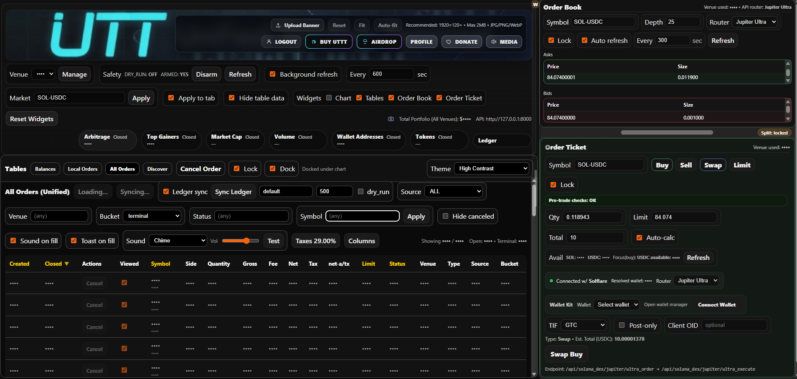
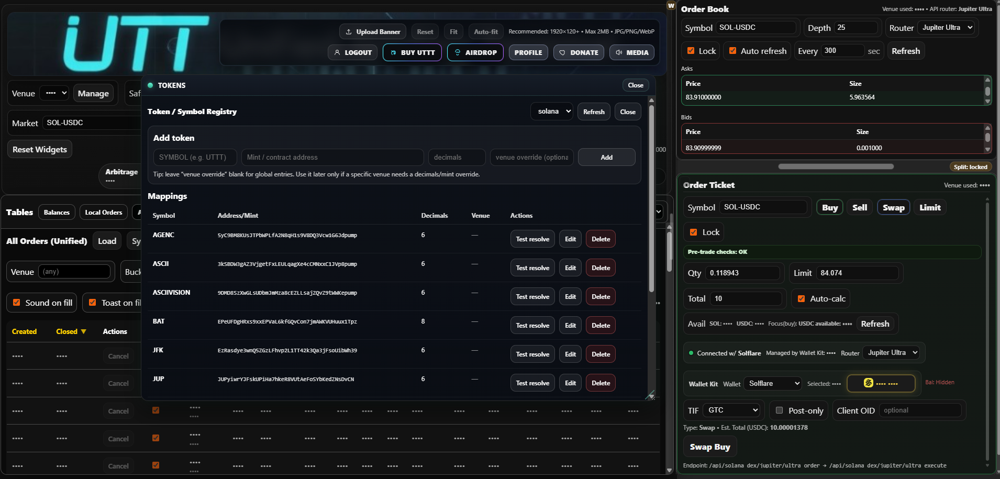

# UTT — Unified Trading Terminal

UTT (Unified Trading Terminal) is a local-first, multi-venue crypto trading terminal built with **FastAPI** on the backend and **React** on the frontend. It is designed to unify centralized exchange (CEX) workflows and selected decentralized exchange (DEX) flows under a single operator-focused interface.

At a high level, UTT aims to provide one place to:

- connect and manage venue credentials
- inspect balances and portfolio state
- view orderbooks and pseudo-orderbooks
- submit and track orders across venues
- monitor scanners, discovery tools, and wallet activity
- work with local ledger/tax-related state and operational tooling
- integrate Solana DEX routing and wallet-based execution alongside traditional exchange adapters

---

## What UTT is

UTT is a **desktop-style browser application** today, but architecturally it is a local trading workstation:

- **Backend:** FastAPI application providing venue adapters, market/order routes, auth/profile endpoints, wallet and ledger tooling, and Solana DEX routing
- **Frontend:** React interface providing a modular multi-window trading terminal UI
- **Storage / local state:** local database/runtime state kept outside of public source control
- **Secrets model:** local/external environment and encrypted credential storage rather than committed secrets

This repository is intended to contain the **application code**, not live credentials, private keys, or production database state.

---

## Major capabilities

### Centralized exchange workflow

UTT includes exchange adapter and routing layers for multiple venues, with a design centered on a unified terminal experience rather than isolated venue-specific apps.

Examples of functionality in the current codebase include:

- venue registry and adapter routing
- balances and account views
- order submission plumbing
- order status aggregation
- all-orders style unified data views
- auth/profile/API-key management flows

### Solana DEX workflow

UTT also includes Solana DEX-specific functionality so on-chain trading can live inside the same interface.

Current architecture in this repository includes support for:

- **Jupiter Metis** swap pathing
- **Jupiter Ultra** order / execution flows
- **Jupiter Trigger** limit-order-related flows
- **Raydium** swap routing
- Solana wallet-aware order ticket behavior
- wallet selection and wallet-manager integration in the frontend
- token resolution, mint lookup, token registry support, and balance helpers

### Operator UI / terminal behavior

The frontend is not a generic dashboard. It behaves like a workstation terminal with independently managed panes and specialized windows.

Examples from the current repository structure and recent work include:

- `App.jsx` as the primary shell
- `WindowManager.jsx` for pane/window behavior
- `OrderBookWidget.jsx`
- `OrderTicketWidget.jsx`
- `TerminalTablesWidget.jsx`
- feature windows such as token registry and scanner-related tooling

### Security / operational direction

UTT is intentionally built around **not** checking secrets into git. The repo is structured to keep code public-ready while sensitive runtime material stays local.

That includes a pattern of:

- external env path loading
- keeping live backend secrets outside the repo
- avoiding committed database/key files
- using local/private credential handling instead of plaintext repository secrets

---

## Repository layout

A simplified view of the current repository structure:

```text
.
├── backend/
│   ├── app/
│   │   ├── adapters/
│   │   ├── routers/
│   │   ├── services/
│   │   ├── venues/
│   │   ├── config.py
│   │   ├── main.py
│   │   ├── models.py
│   │   └── schemas.py
│   ├── alembic/
│   ├── data/
│   └── keys/
├── frontend/
│   ├── public/
│   └── src/
│       ├── app/
│       ├── components/
│       ├── features/
│       ├── hooks/
│       ├── lib/
│       ├── utils/
│       ├── App.jsx
│       ├── main.jsx
│       ├── OrderBookWidget.jsx
│       ├── OrderTicketWidget.jsx
│       └── TerminalTablesWidget.jsx
├── scripts/
├── .env.example
└── .gitignore
```

### Important directories

#### `backend/app/adapters/`
Venue-specific adapter logic and exchange integration helpers.

#### `backend/app/routers/`
FastAPI routers exposing backend functionality to the frontend and local operator workflows.

#### `backend/app/services/`
Shared service-layer logic such as aggregated order handling.

#### `backend/app/venues/`
Venue registration and integration mapping.

#### `frontend/src/`
Main frontend application code, widgets, feature windows, hooks, and supporting libraries.

#### `scripts/`
Utility scripts and local development helpers.

---

## Current frontend focus

The UI is built around a multi-pane trading terminal rather than a static page layout.

Recent and current areas of focus include:

- right-lane tile and splitter behavior
- terminal-style window management
- order book and order ticket integration
- table/ledger/order views
- Solana wallet-manager integration for DEX flows
- registry/tool windows

In practical terms, this means the frontend favors:

- task-oriented windows
- local workflow efficiency
- keyboard/mouse hybrid usage
- dense operator information over marketing-style UI

---

## Current backend focus

The backend acts as the local orchestration layer for UTT. It is not just a thin API wrapper.

It is responsible for things such as:

- venue adapter access
- wallet and market routing
- order creation/cancellation support
- unified order views
- token and symbol resolution
- local auth/profile/config integration
- Solana DEX route construction and transaction preparation
- local environment / secret resolution patterns

The backend should be treated as the source of truth for trading-side behavior, while the frontend is the terminal for interacting with it.

---

## Supported / integrated areas in the codebase

The exact state of each venue may evolve over time, but the repository structure currently includes work across:

- Coinbase
- Crypto.com Exchange
- Dex-Trade
- Gemini
- Kraken
- Robinhood
- Solana DEX flows
  - Jupiter
  - Raydium

There are also supporting routes and tooling for:

- auth/profile flows
- token registry
- wallet address handling
- all-orders aggregation
- scanner/discovery windows
- airdrop-related routing/tooling

---

## Quick start

> **Important:** UTT is designed to run with local configuration and local secrets. Do **not** paste real keys into tracked files. Keep runtime secrets outside the repository.

### Prerequisites

Recommended baseline:

- **Python 3.10+**
- **Node.js 18+** and npm
- Windows PowerShell for the Windows-oriented commands below
- a local Solana wallet extension if using Solana DEX features
- venue API credentials if testing exchange integrations

### 1) Clone the repository

```powershell
git clone https://github.com/<your-account>/utt-unified-trading-terminal.git
cd utt-unified-trading-terminal
```

### 2) Configure backend environment

The project uses an external env-path pattern so secrets can live **outside** the repo.

At minimum, inspect:

- `.env.example`
- `backend/.env`
- `backend/app/config.py`

A common pattern is:

```env
UTT_ENV_PATH=C:\path\to\your\private\backend.env
```

Then your actual private `backend.env` file can live outside the repo and contain local-only secrets/config.

### 3) Create and activate a backend virtual environment

```powershell
cd backend
python -m venv .venv
.\.venv\Scripts\Activate.ps1
```

### 4) Install backend dependencies

Use the dependency file present in your checkout.

If the repo uses `requirements.txt`:

```powershell
pip install -r requirements.txt
```

If the repo uses `pyproject.toml`, install according to that project file instead.

### 5) Start the backend

The current backend tree includes `backend/app/main.py`, so a common local run command is:

```powershell
uvicorn app.main:app --reload --host 127.0.0.1 --port 8000
```

If your local checkout uses a different startup module, adjust accordingly.

### 6) Install frontend dependencies

In a separate terminal:

```powershell
cd frontend
npm install
```

### 7) Configure frontend env

A typical local setting is:

```env
VITE_API_BASE=http://127.0.0.1:8000
```

### 8) Start the frontend

```powershell
npm run dev
```

Then open the local Vite URL shown in the terminal.

---

## Installation notes by environment

### Windows

The repository and current operator workflow are heavily Windows-tested / PowerShell-oriented. This is the easiest platform to start with.

### Linux / macOS

The backend/frontend stacks are portable in principle, but local pathing, shell scripts, wallet extension workflows, and some venue-specific tooling may need adaptation.

---

## Environment and secrets model

UTT is intentionally structured so that **public source code** can live in git while **live credentials** remain local.

### What should be in the repository

- code
- schema/model definitions
- example env files
- non-sensitive defaults
- UI assets meant for publication
- utility scripts that do not contain secrets

### What should **not** be in the repository

- real API keys
- private keys / PEM files
- local DB files
- production runtime logs
- wallet seed phrases / mnemonics
- local backup data
- locally generated venue key material

### Recommended practice

- keep private env files outside the repo
- use tracked stub files only
- scan staged diffs before pushing
- keep any wallet/account testing material separate from source control

---

## Solana DEX notes

The Solana side of UTT is designed to fit into the same terminal as the CEX workflows rather than being a separate application.

### Current flow areas in the codebase

- wallet-aware order ticket behavior
- Jupiter Metis route handling
- Jupiter Ultra order/execute support
- Jupiter Trigger / limit-related routing
- Raydium swap path construction
- token resolution and token-account-aware routing
- token registry lookups
- balance and wallet helper flows

### Wallet behavior

The frontend integrates wallet-selection and wallet-manager behavior for supported Solana wallets. Because wallet/account state matters, two different wallet extensions can behave differently if they are connected to **different actual addresses** with different balances and token accounts.

That means a route succeeding in one wallet and failing in another does **not** necessarily indicate a code bug. It may indicate:

- different wallet address
- different token balances
- missing associated token account for a given mint
- router-specific account requirements

---

## Auth, profile, and local credential handling

The codebase includes auth/profile flows and local credential-management work. In practical terms, that means UTT is intended to be an operator workstation, not just a stateless public dashboard.

Examples of functionality reflected in the current repository include:

- profile/auth routing
- API-key management UI flows
- DB-backed / encrypted secret-bundle patterns in code
- local runtime settings and operator preferences

If you are making the repository public, review these sections carefully and confirm no real values are present anywhere in history or working files.

---

## Token registry and wallet tooling

The repository currently includes token-registry-related backend and frontend work. This is useful for:

- symbol/mint resolution
- display-friendly token labeling
- registry-managed token metadata
- Solana token tooling inside the operator UI

There is also wallet-address handling in the backend, which supports broader local wallet/workflow integration.

---

## Orderbook and order-ticket model

UTT uses a unified terminal style where the order book, order ticket, tables, scanners, and other panes are all parts of one coordinated workstation.

### Order book

Current work includes:

- venue-aware order book display
- pseudo-orderbook behavior for DEX routes
- right-lane terminal tile integration

### Order ticket

Current work includes:

- venue-aware order entry
- Solana wallet-manager integration
- Jupiter/Raydium route selection for DEX paths
- operator status and preflight behavior

---

## Data and runtime state

You may see empty tracked directories such as `backend/data/` or `backend/keys/` that exist only to preserve folder structure.

That does **not** mean the repository is intended to contain live runtime data.

In general:

- keep runtime DB files out of source control
- keep generated key material out of source control
- keep local backups out of source control
- use `.gitignore` and external paths appropriately

---

## Troubleshooting

### Frontend starts but cannot reach backend

Check:

- backend is running
- `VITE_API_BASE` points to the correct backend URL
- backend host/port are reachable from the frontend

### Backend starts but venue requests fail

Check:

- local env path is correct
- required credentials exist in your private env or local credential store
- no real credentials were placed into tracked files by mistake

### Solana wallet connects but a trade fails

Check:

- which wallet address is actually connected
- whether that address has the required input token balance
- whether that address has the required token account for the mint being used
- which router is selected (Metis / Ultra / Raydium)

### UI layout looks wrong

The terminal UI uses pane/window logic and multiple specialized widgets. If layout behavior is off:

- confirm frontend dependencies are installed correctly
- confirm you are on the current frontend codebase
- check recent widget/window-manager changes
- reload after significant layout or wallet-manager updates

---

## Screenshots

It is strongly recommended to add screenshots before making the repository public.

Suggested location:

```text
docs/screenshots/
```

Suggested screenshot set:

- main trading terminal overview
- right-lane order book / order ticket view
- token registry window
- Solana wallet-manager / DEX ticket view
- tables / all-orders / balances view

Example README image usage once screenshots are added:

```md



```

---

## Suggested public README polish checklist

Before flipping the repository public, consider doing the following:

- add screenshots under `docs/screenshots/`
- add a license file if you want clear reuse terms
- verify there are no secrets in git history
- review GitHub Actions/log visibility
- add a short disclaimer if this is not production-ready software

---

## Security notes

This project interacts with trading infrastructure and wallet/account workflows. Treat it accordingly.

### Recommended operator posture

- use local-only secrets
- review staged diffs before every push
- use separate accounts/wallets for testing
- avoid storing sensitive values in plaintext inside the repo
- keep local DB/backup/key files outside version control

### Important disclaimer

This software is for operator workflows and development/testing purposes. Use at your own risk. Nothing in this repository should be treated as financial advice, investment advice, or a guarantee of trading outcomes.

---

## Development philosophy

UTT is being developed as a practical operator terminal with an emphasis on:

- local-first workflows
- unified venue handling
- terminal-style density and control
- security-conscious secret handling
- incremental, surgical changes instead of destructive rewrites

---

## Contributing

If you plan to accept contributions publicly, you may want to add:

- `CONTRIBUTING.md`
- issue templates
- PR templates
- coding/style notes
- security disclosure instructions

For now, the safest contribution model is:

1. open an issue describing the change
2. discuss scope before major architectural changes
3. avoid committing secrets, runtime data, or local credential material
4. keep changes surgical and testable

---

## License

This project is licensed under the **MIT License**.

See the top-level [LICENSE](LICENSE) file for the full license text.

## Status

UTT is an actively evolving trading terminal codebase with ongoing work across:

- UI/layout refinement
- Solana wallet and router integration
- registry/tool windows
- auth/profile/API-key handling
- venue adapter coverage
- unified order and ledger workflows

Expect active iteration rather than a frozen, final product.
