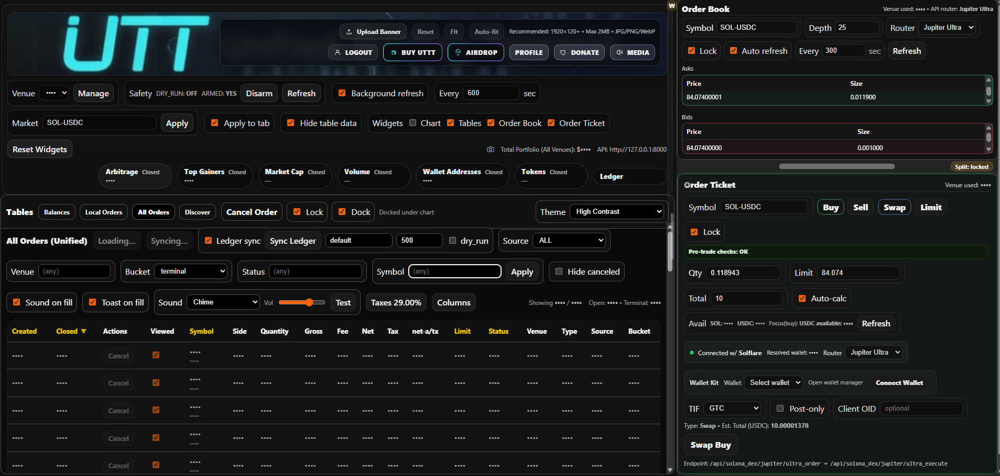
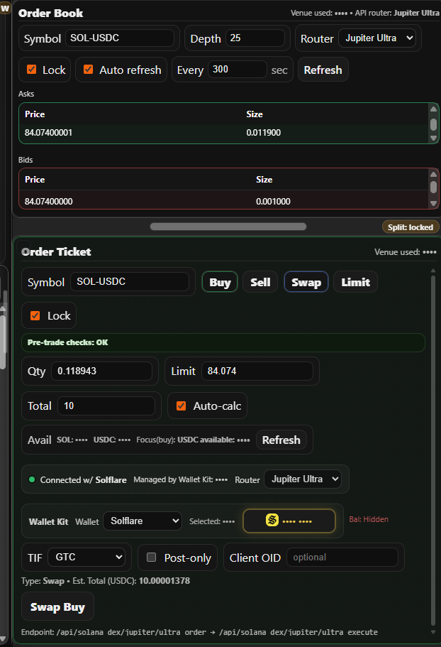
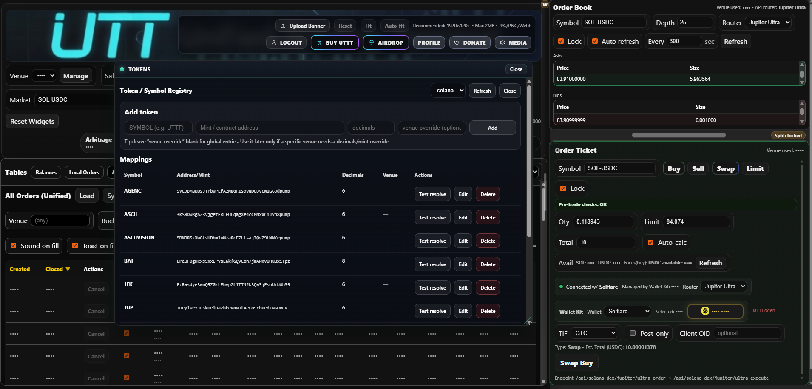
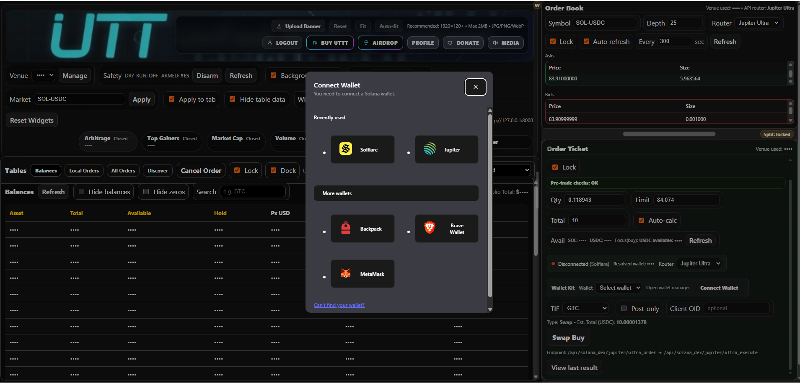
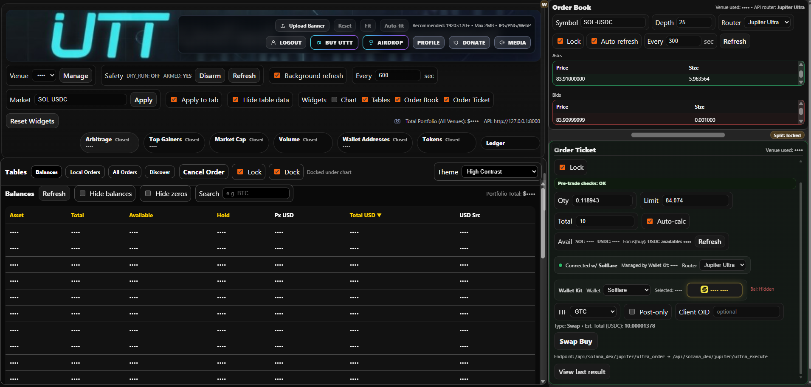
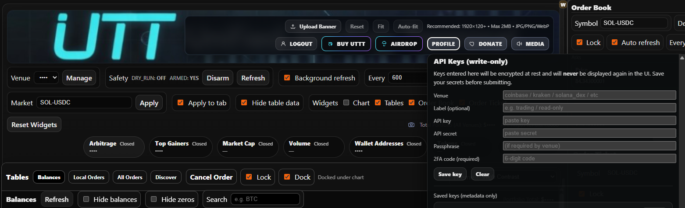

# UTT — Unified Trading Terminal

UTT (Unified Trading Terminal) is a local-first, multi-venue crypto trading terminal built with **FastAPI** on the backend and **React** on the frontend. It is designed to unify centralized exchange (CEX) workflows and selected decentralized exchange (DEX) flows under a single operator-focused interface.

> **Current documented baseline:** this README is prepared for the cumulative publication following published baseline `977a6396a9215a80c6ba98663a50398613114b4d`. It retains the previously published Counterparty / UniSat, SEC-VAULT.1, Cexius, generic Order Details, managed Arbitrage, Solana, Hydration, Market Metrics, and Spread / Bridge capabilities and adds the accepted generic Robinhood Chain execution, historical/incremental wallet-ingestion, external-swap materialization, All Orders Sync+Load orchestration, known-UTT/external idempotency, and ERC-20 USD balance-pricing work. Cexius market orders, Cexius Cancel All, automated arbitrage execution, and generic Robinhood Chain Cost Basis / Cost Avg reconstruction are not implied by the current scope.

At a high level, UTT provides one place to:

- connect and manage venue credentials through an owner-scoped encrypted local API-key vault with metadata-only inventory and read-only migration defaults
- inspect balances, available amounts, holds, priced totals, cost basis, average cost, and gain/loss columns
- view CEX orderbooks, DEX pseudo-orderbooks, Counterparty dispenser / protocol-order books, synthetic price-context books, and manual route books
- submit and track CEX orders, cancel supported venue orders, and monitor venue-native order snapshots
- trade through supported live-gated CEX adapters such as Coinbase, Crypto.com, Cexius, Dex-Trade, Gemini, Kraken, Robinhood, and OKX where configured
- use Counterparty / UniSat workflows for Bitcoin-metaprotocol assets, collectibles, orderbook context, unsigned compose review, explicit PSBT signing, and separately gated broadcast
- use Robinhood Chain for registry-backed EVM balances, 0x and provider-scoped read-only indicative quote discovery, Token Registry-driven selected-pair registration, synthetic books, bounded exact-input planning, controlled browser-wallet execution, receipt reconciliation, historical/incremental wallet ingestion, external-swap materialization, All Orders Sync+Load, and deterministic ERC-20 USD balance pricing
- submit and track Solana swaps / limit-style flows and confirmed Hydration manual-route swaps
- monitor scanners, discovery tools, Ordinals / Counterparty collectibles, wallet activity, market-cap data, volume data, and self-custody balances
- filter Market Cap and Volume windows by All / Owned / Unowned and by venue/source such as Coinbase, Crypto.com, Dex-Trade, Gemini, Hydration, Kraken, OKX, Robinhood, self-custody, Solana, and Solana-Jupiter
- work with local ledger, deposits, withdrawals, missing-basis lots, transfer links, FIFO lot-impact previews, and tax-related state
- preview per-fill basis impact for supported venue fills without mutating FIFO lots
- plan cross-chain UTTT movements with bridge-transfer records, canonical supply context, per-chain supply context, and read-only basis previews
- manage Token Registry rows, Hydration Route Registry rows, wallet addresses, venue API keys, and local operator preferences
- inspect a managed read-only Arbitrage window with best bid/ask, spread, per-venue top-of-book rows, manual refresh, and bounded auto-refresh
- integrate Solana and Polkadot / Hydration DEX routing and wallet-based execution alongside traditional exchange adapters

---

## What UTT is

UTT is a desktop-style browser application today, but architecturally it functions as a local trading workstation:

- **Backend:** FastAPI application providing venue adapters, market/order routes, auth/profile endpoints, wallet and ledger tooling, Counterparty / Bitcoin-metaprotocol services, bounded EVM / Robinhood Chain services, Solana DEX routing, and Polkadot / Hydration routing
- **Frontend:** React interface providing a modular multi-window trading terminal UI
- **Storage / local state:** local database and runtime state kept outside of public source control
- **Secrets model:** local or external environment loading for runtime config, plus profile-managed encrypted credential storage for exchange API keys

This repository contains the application code, not live credentials, private keys, or production database state.

---

## Capability index

UTT is best understood as a local operator workstation rather than a single exchange wrapper. The current codebase covers these broad function groups:

### Trading and execution

- CEX order-ticket submission for integrated venues with backend safety gates.
- Venue-native cancel paths where the venue adapter supports cancellation.
- Unified CEX order lifecycle tracking through local `orders` rows and read-only `venue_orders` snapshots.
- Venue order refresh with per-venue and all-venue refresh paths.
- Status normalization across venue-specific order states.
- Order rule inspection, including quantity steps, price ticks, minimum quantity, supported order types, supported time-in-force values, and post-only support where the venue exposes it.
- Server-side pre-trade normalization to venue increments before live order placement.
- Dry-run / armed / live-venue gate enforcement so live trading cannot occur only because the UI is visible.
- OKX gated live submit and cancel support using the OKX trade endpoint and cancel endpoint, while leaving withdrawals unsupported.
- Cexius public and authenticated REST integration with complete paginated order snapshots, normalized balances and rules, selected-order cancellation, and limit BUY / SELL submission behind the shared live gates.
- Counterparty read-only market / balance discovery, unsigned compose previews, explicit UniSat `signPsbt`, and separately gated `pushPsbt` broadcast with no backend signing or automatic broadcast.
- Robinhood Chain registry-backed quote discovery, unsigned transaction planning, generic Token Registry-backed exact-input execution authority, finite ERC-20 approval, separate browser-wallet requests, receipt reconciliation, historical/incremental wallet ingestion, and external-swap materialization.
- Solana DEX swap and limit-style flow integration where the selected wallet and route support the requested pair.
- Hydration manual XYK and confirmed manual Router swap-transaction preparation for known route-registry rows.

### Market data and routing context

- CEX orderbooks where venue adapters expose them, including a direct-symbol Cexius fast path that avoids a redundant market-catalog lookup.
- Managed Arbitrage snapshots that compare configured venue top-of-book data without creating an execution path.
- DEX pseudo-orderbooks for route-based execution contexts.
- Counterparty ASSET-BTC dispenser and protocol-order context with exact audit prices, mode separation, USD reference values, and rate-limit-safe fallback behavior.
- Robinhood Chain pair catalog and provider-backed synthetic books for registry-authorized directional quote context.
- Hydration manual/live UTTT-HDX pseudo-orderbook generation from live pool reserves.
- Hydration synthetic orderbook rows for price context only, kept non-tradable unless a safe route exists.
- CoinGecko-backed market-cap and volume windows through a backend cache layer.
- Token Registry-first external price mapping for deterministic asset-to-market-data resolution.
- Source and venue filtering in Market Cap and Volume windows for owned and unowned asset discovery.
- Backend summary snapshots and browser snapshot caches to keep market windows usable during external API backoff.

### Portfolio, balances, and accounting context

- Per-venue balances with total, available, and hold values.
- Cexius balance normalization that treats spendable balance separately from locked, reserved, and trading-locked amounts without double counting.
- USD pricing enrichment for balances when requested.
- AppHeader portfolio totals across CEX, Counterparty / Bitcoin, Robinhood Chain, Solana DEX, Hydration DEX, and cached self-custody balances where configured.
- Counterparty asset and BTC balances resolved from the configured Wallet Addresses account, with direct or ASSET-BTC-derived USD valuation when sufficiently authoritative.
- Robinhood Chain native ETH and Token Registry-authorized ERC-20 balances using bounded EVM RPC reads plus deterministic USD pricing from stable mappings, explicit CoinGecko IDs, or exact registered ASSET→USDG read-only quote fallback.
- Cost basis and average cost columns on balance rows.
- Basis status indicators such as OK, partial, missing, unmatched, no lots, and not applicable.
- Basis lot drilldown from balance rows.
- 1D gain percentage and total gain percentage display where enough market/basis data exists.
- All Venues grouping and de-duplication logic for self-custody and live Solana balance rows.
- Missing-basis tracking without inventing USD basis.
- FIFO preview/apply paths kept separate from passive balance and market-data windows.

### Unified orders, realized state, and operator workflow

- All Orders view that merges local orders, venue order snapshots, and supported DEX swap records.
- Open and terminal bucket separation.
- Cancelability detection for open venue rows.
- Generic read-only Order Details windows for terminal and noncancelable transaction-bearing rows, with draggable/resizable top-layer presentation, persistent geometry, and Reset controls.
- Cexius open, filled, canceled, and rejected lifecycle reflection with selected-order cancellation, truthful simulated cancellation behavior, and no Cancel All path.
- Fee, gross, net, tax-estimate, and net-after-tax display fields where backend data exists.
- Viewed/confirmed tracking for operator review workflows.
- Sound and toast-on-fill UI behavior.
- OKX normalized order economics, including signed-fee normalization and `total_after_fee` calculation for fills.
- OKX fills-history diagnostics and per-fill basis-preview rows without creating fill records or mutating basis lots.
- Confirmed Counterparty purchases reflected into All Orders after explicit wallet signing / broadcast evidence exists.
- Confirmed Robinhood Chain swaps reflected into All Orders with direction-correct BUY / SELL quantity, gross, net, fee, average-price, and limit-rate economics.

### Ledger, wallet, basis, and transfer workflows

- Asset deposits and withdrawals as local ledger objects.
- Basis lots as local inventory objects.
- Missing-basis lot creation for detected deposits.
- Transfer-link preview and metadata-only linking for likely internal movements.
- Explicit-only FIFO lot-impact rebuilds.
- Dry-run-first handling for ledger materialization and basis impact.
- Hydration wallet-history ingestion into cached wallet-address transaction rows.
- Deposit and withdrawal materialization from trusted cached wallet transactions.
- Counterparty purchase accounting previews that separate acquired asset quantity, BTC consideration, Bitcoin miner fee, historical BTC/USD context, custody scope, and candidate source-lot impact without mutating ledger or FIFO state.
- Robinhood Chain transaction-history/accounting previews plus checkpointed historical/incremental wallet evidence ingestion, known-UTT lifecycle reuse, and high-confidence external-swap materialization with idempotent downstream accounting.
- Internal transfer and bridge planning surfaces that avoid treating transfers as taxable disposals by default.

### UTTT-specific workflows and use cases

UTTT is treated as a first-class project asset inside UTT. The application does not merely display a token balance; it provides operator tooling around UTTT routing, pricing, supply context, and cross-chain movement planning.

Current UTTT-related functions and use cases include:

- Token Registry metadata for UTTT on supported chains and venues.
- Solana mint / token-account resolution for UTTT-related Solana flows.
- UTTT-SOL / Solana DEX visibility where local token metadata and liquidity routes are configured.
- Hydration UTTT-HDX route metadata through the Hydration Route Registry.
- Manual/live UTTT-HDX orderbook generation from live Hydration pool reserves.
- UTTT/USD derivation from UTTT-HDX route pricing multiplied by HDX/USD.
- Spread / Bridge dashboard comparison of Solana-side UTTT price context and Hydration-derived UTTT price context.
- Total Canonical Supply display for UTTT across supported chain contexts.
- Per-chain UTTT supply rows, including Solana, Asset Hub / Polkadot-side context, and Hydration route metadata without double-counting canonical supply.
- Bridge transfer-record planning for UTTT movements such as Solana-to-Hydration or Hydration-to-Solana movements.
- Source and destination evidence linkage for planned UTTT movements.
- Reconciliation of local UTTT bridge-transfer records.
- Read-only basis / tax-treatment preview for UTTT bridge-transfer records.
- Read-only apply-basis-transfer preview to model future basis movement without mutating lots.
- Operator use cases such as UTTT treasury visibility, liquidity monitoring, cross-chain supply review, bridge test planning, price-spread review, and route-readiness diagnostics.

UTTT bridge execution and basis-transfer mutation remain intentionally separated from planning. The README describes the current planning, routing, accounting, and diagnostics surfaces; it does not imply that UTT automatically executes bridges or mutates basis across chains.

---

## Major capabilities

### Centralized exchange workflow

UTT includes exchange adapter and routing layers for multiple venues, with a design centered on a unified terminal experience rather than isolated venue-specific apps.

Current functionality in the codebase includes:

- venue registry and adapter routing
- balances, available/held amounts, account views, and priced portfolio totals
- order submission plumbing, cancellation paths, and venue-order refresh
- live-gated order submission where the adapter and safety gates allow it
- live-gated cancellation through All Orders for supported venues
- order status aggregation and local order reconciliation
- unified all-orders style data views, including swap-order reflection where supported
- order rules / pre-trade checks for supported venues
- cost-basis, gain, net, fee, and tax-aware display fields where backend data is available
- Robinhood balance hold handling using a fast open-order overlay so balance refresh is not blocked by full order-history scans
- OKX read-only diagnostics, balances, orderbooks, rules, venue orders, fills diagnostics, basis previews, live-gated submit, and live-gated cancel
- auth, profile, local session, database backup, 2FA, and API-key management flows

#### OKX integration

The OKX adapter is now integrated as a live-gated CEX venue. OKX support includes:

- public instrument discovery
- public orderbook retrieval
- order-rule inspection for quantity steps, price ticks, minimum quantity, order type support, time-in-force support, and post-only support
- private balances through profile-managed credentials
- venue-order refresh for open, canceled, and filled OKX rows
- All Orders integration for OKX open and terminal buckets
- signed OKX fee normalization into positive UTT fee-cost values
- `total_after_fee` calculation for filled OKX rows when fill economics are available
- OKX fills-history diagnostics grouped by OKX order ID
- per-fill basis preview for OKX fills without creating fill rows or mutating basis lots
- live-gated order submission through the unified Order Ticket
- live-gated cancellation from All Orders
- Market Cap and Volume source filtering so OKX-held assets appear under the OKX source filter

OKX live routing remains explicitly guarded. A visible OKX Order Ticket is not enough to place an order. Live OKX submit/cancel requires the backend to be armed, dry-run to be disabled, `LIVE_VENUES` to include `okx`, and `OKX_ENABLE_TRADING=1`. OKX withdrawal support is intentionally not implemented.


#### Cexius integration

The Cexius adapter is integrated as a vault-backed REST venue with public market data, authenticated account reads, and tightly bounded live order mutations.

Current Cexius capabilities include:

- public market catalog, market rules, ticker, trades, candles, fees, and orderbook reads
- a direct-symbol orderbook fast path so orderbook refresh does not wait on a full market-catalog lookup
- profile-vault Bearer-token authentication with explicit Read and Trade scope metadata and no credential environment fallback
- normalized balances with distinct `Total`, `Available`, and `Hold` semantics
- bounded pagination for complete open-order retrieval, duplicate suppression, repeated-page protection, and coherent open / filled / canceled persistence
- unified All Orders visibility, including truthful `I/E` display when a filled disposal has insufficient venue-scoped inventory and `—` for canceled-order tax
- API-authoritative quantity precision, price precision, minimum quantity, and minimum notional handling, including the observed Cexius `trading_amount_precision`, `trading_price_precision`, `trading_min_amount`, and minimum-order-value fields
- selected single-order cancellation through the shared confirmation and `cancel_by_ref` path
- non-mutating cancellation simulation while disarmed or in dry-run mode; simulated actions do not rewrite local rows as canceled
- limit BUY and SELL submission only, with manually editable Quantity, Limit, and Total, optional Auto-calc, explicit final confirmation, and exactly one upstream request
- immediate order and balance refresh after an authoritative live submit or cancel
- generic read-only Details windows for terminal Cexius rows

Cexius live routing remains explicitly guarded. A visible Order Ticket is not enough to submit or cancel an order. Live mutation requires `DRY_RUN=false`, `ARMED=true`, `LIVE_VENUES` to include `cexius`, a matching enabled venue capability, and a Profile-vault credential declared for both Read and Trade. The implementation intentionally does not enable market orders, Cancel All, withdrawals, deposit-address generation, or automatic retry.

A zero-fill open order is not execution evidence and is excluded from ledger/FIFO processing. Existing filled rows may correctly show `I/E` when Cexius-scoped inventory is unavailable; basis and tax values are not fabricated. Organic-fill revalidation remains an operational follow-up rather than a claim that every historical fill has complete local basis.

### Counterparty / UniSat workflow

UTT includes a Bitcoin-metaprotocol integration for Counterparty assets and UniSat browser-wallet workflows. This is separate from the CEX adapters and from the EVM-based Robinhood Chain path.

Current Counterparty / UniSat capabilities include:

- Counterparty mainnet diagnostics and API routing through the `counterparty` venue
- configured source-address resolution from **Wallet Addresses**, rather than depending on hidden browser state
- Counterparty asset metadata, balances, sends, dispensers, orders, and orderbook context
- BTC plus Counterparty asset balances in the main Balances workflow
- direct Token Registry / Market Metrics USD pricing when a deterministic mapping exists
- ASSET-BTC-derived reference valuation using visible Counterparty liquidity and BTC/USD when direct USD mapping is unavailable
- stale-last-good balance fallback and bounded derived-price work
- Token Registry support for Counterparty asset identity and metadata
- UniSat account, network, public-key, BTC-balance, and inscription discovery
- an Ordinals / Counterparty collectibles window with asset metadata and media previews where available
- read-only market-context previews for Counterparty assets
- separate **Dispenser Purchase** and **Protocol Order** modes
- exact dispenser lot-price handling so an indivisible or fixed-lot purchase cannot be silently rescaled
- unsigned compose previews with selected-book-level identity, source address, expiration, fee tier, and funding requirements
- Bitcoin fee-tier support and positive miner-fee validation
- PSBT input enrichment with UTXO metadata before wallet signing is enabled
- explicit UniSat `signPsbt` handoff only after review and funding checks pass
- separately confirmed UniSat `pushPsbt` broadcast only when `COUNTERPARTY_LIVE_BROADCAST_ENABLED=1`
- automatic broadcast disabled in all modes
- sensitive signed PSBT material retained only in the browser workflow and redacted from ordinary result display
- confirmed Counterparty purchases reflected into All Orders
- read-only accounting previews for acquired asset, BTC consideration, miner fee, historical BTC/USD, custody scope, and candidate BTC source-lot impact

Counterparty execution remains review-first. The backend may request public data and build an unsigned compose preview, but it does not hold a Bitcoin private key, sign a PSBT, or broadcast a transaction. Signing and broadcast are separate browser-wallet actions, and broadcast is never automatic.

### Robinhood Chain workflow

UTT includes a dedicated Robinhood Chain integration that is separate from the Robinhood Crypto brokerage adapter. The current chain configuration targets **Robinhood Chain mainnet, chain ID 4663**, and uses a browser EVM wallet such as MetaMask for any signing.

Current Robinhood Chain capabilities include:

- explicit venue registration and chain diagnostics
- bounded HTTP RPC reads with timeout, cache, concurrency, and error-backoff controls
- optional WebSocket configuration for future or diagnostic use
- MetaMask linkage that is initiated only by an explicit operator action
- native ETH balance reads
- Token Registry-authorized ERC-20 identity and balance reads
- unified portfolio pricing for registered Robinhood Chain assets
- bounded Blockscout-backed transaction-history display
- read-only transaction and accounting previews
- 0x-backed indicative quote discovery using a profile-managed API key stored under venue `zerox`
- provider-scoped read-only Uniswap indicative quote support where configured, with quote access kept separate from disabled provider swap / order endpoints
- registry-driven pair objectives, directional capabilities, token identity, provider identity, and execution authority
- review-only selected-pair registration and refresh so a discovered pair can be added to the local catalog without automatically receiving live execution authority
- lazy directional discovery rather than broad N-squared pair probing
- pair catalogs and synthetic provider-backed orderbook context
- unsigned exact-input planning with saved-wallet, chain, provider, pair, direction, and amount binding
- directly editable Quantity and Total fields with optional Auto-calc; persisted unlimited or blanket preauthorization is not required
- finite ERC-20 approval planning; unlimited approval remains disabled
- explicit separation between approval and swap wallet requests
- short-lived provider plans and claim IDs that fail closed when stale, mismatched, or already consumed
- read-only lifecycle restoration by exact execution ID or latest matching pair / direction / wallet lookup
- controlled, live-validated WETH-USDG BUY and SELL lifecycles retained as regression controls
- generic Token Registry-backed exact-input execution for selected registered pairs when the current pair/direction/provider capability passes the same bounded authority and preflight gates
- exact on-chain receipt reconciliation, actual input/output calculation, network-fee calculation, and submission-count evidence
- receipt-log reconciliation for the explicit case where a non-archive RPC serves the transaction and receipt but cannot serve the required historical ERC-20 balance snapshots
- checkpointed historical/incremental wallet-evidence ingestion for configured Robinhood Chain Wallet Addresses
- known-UTT lifecycle reuse so scanner evidence does not create duplicate external orders, journals, or lots
- strict high-confidence external-swap materialization for outside-UTT MetaMask / DEX activity
- All Orders `Sync+Load` integration with the same incremental scanner/materializer path
- direction-correct All Orders normalization, exact canonical venue identity, and pre-pagination canceled/rejected filtering
- deterministic ERC-20 USD balance pricing with bounded caching and read-only quote fallback

Current accepted execution scope is **registry-driven but still explicitly gated**:

```text
selected Token Registry pair
→ supported direction and exact-input amount mode
→ explicit execution authority
→ fresh provider plan
→ finite approval only when required
→ fresh post-approval swap-only preflight
→ one explicit browser-wallet swap request
→ confirmed receipt reconciliation
```

Previously validated WETH-USDG BUY / SELL remains covered, and generic selected-pair execution has now also been validated through the same safety model. A registered token or successful quote still does **not** automatically grant live authority: the pair/direction must pass the current capability, amount, wallet, provider, freshness, simulation, balance, and gas gates.

Robinhood Chain safety boundaries include:

- no automatic wallet connection
- no wallet request during passive quote, balance, lifecycle-restore, or authorization reads
- no backend private key
- no backend signing
- no backend transaction send
- no automatic approval
- no unlimited approval
- no automatic second transaction
- no automatic retry
- no execution promotion merely because a provider quote exists
- no ledger, FIFO, or basis mutation from quote, planning, execution-evidence, or All Orders display paths

### Solana DEX workflow

UTT also includes Solana DEX-specific functionality so on-chain trading can live inside the same interface.

Current architecture in this repository includes support for:

- **Jupiter Metis** swap pathing
- **Jupiter Ultra** order and execution flows
- **Jupiter Trigger** limit-order-related flows
- **Raydium** swap routing
- Solana wallet-aware order ticket behavior
- wallet selection and wallet-manager integration in the frontend
- token resolution, mint lookup, token registry support, and balance helpers

### Polkadot / Hydration DEX workflow

UTT includes a Polkadot / Hydration integration path focused on routing UTTT-HDX activity through the same terminal workflow as CEX and Solana DEX activity.

Current architecture in this repository includes support for:

- **Polkadot-Hydration** venue routing
- Hydration RPC access through profile-managed API keys
- Token Registry-managed Hydration asset metadata
- Token Registry-managed external price metadata
- Hydration Route Registry support for manual/live pool routes and confirmed manual Router route rows
- UTTT-HDX manual XYK orderbook generation from live pool reserves
- DOT-HDX and HDX-DOT confirmed manual Router routes through Aave / aDOT / Omnipool
- Hydration order-ticket execution plumbing for UTTT-HDX, DOT-HDX, and HDX-DOT
- Hydration balances in terminal tables and wallet-address views
- external USD price enrichment for HDX and DOT
- UTTT/USD derivation from UTTT-HDX live route pricing and HDX/USD
- Hydration price-cache status reporting with clear fresh, stale, partial, and unavailable classifications
- persistent Hydration sidecar quote-cache / singleflight / backoff protection for controlled SDK diagnostics
- Hydration order-ticket execution plumbing for UTTT-HDX manual XYK sell/exact-in and buy/exact-out flows
- Hydration manual Router sell/exact-in and buy/exact-out flows for confirmed route-registry pairs such as DOT-HDX and HDX-DOT
- generic Hydration SDK router quote and orderbook paths blocked by default unless explicitly enabled
- compact Hydration UI price-status indicators in Order Book and Order Ticket using status-only backend polling
- Hydration swap recording into the unified all-orders flow through `swap_orders`
- Hydration wallet-history ingestion through an optional Subscan-backed provider path
- wallet-address transaction caching before deposit / withdrawal materialization
- Hydration-derived deposit and withdrawal materialization with source provenance
- missing-basis lot creation for detected deposits without inventing USD basis
- transfer-link preview and metadata-only linkage for internal transfer candidates
- explicit-only FIFO withdrawal lot-impact rebuilds with dry-run-first safety
- LP / Omnipool special handling for 2-POOL-style rows that should not be forced through normal FIFO

The public-safe Hydration path avoids generic SDK quote polling for pricing. Broad SDK router quotes are disabled by default while the UTTT-HDX route uses registry-backed manual/live pool metadata. External USD pricing and cache-only status endpoints are the normal price path; the persistent sidecar quote cache is used as a controlled diagnostic/protection layer, not as a UI polling loop.

### Market metrics workflow

UTT includes backend-cached market metrics for operator tool windows and AppHeader summaries.

Current architecture in this repository includes support for:

- AppHeader **Market Cap** and **Volume** tool-tab windows
- selected-asset market cap and volume summaries in the AppHeader tool tabs
- backend-cached CoinGecko market data with TTL, stale-cache behavior, and rate-limit backoff
- DB-owned / tracked asset discovery for market-metrics windows
- All / Owned / Unowned filtering for market-metric rows
- source filtering by venue or source context such as Coinbase, Crypto.com, Dex-Trade, Gemini, Hydration, Kraken, OKX, Robinhood, self-custody, Solana, Solana-Jupiter, and Derived rows
- Token Registry-managed external price IDs as the preferred market-data resolver
- automatic CoinGecko symbol discovery for explicitly selected assets when no registry mapping exists
- browser and backend summary snapshot behavior so windows can continue showing the last usable payload during refresh timeout or rate-limit events
- re-annotation of cached summary rows with current local asset context so newly added venues such as OKX can appear without requiring a full live market-data refresh
- graceful unavailable / placeholder rows for unsupported or unresolved assets

The frontend does not call CoinGecko directly. Market-cap and volume windows read normalized data from the backend market-metrics service, while the backend owns source selection, caching, rate-limit handling, and symbol-to-source resolution.

### Managed Arbitrage snapshot workflow

UTT includes a canonical WindowManager-based Arbitrage window for comparing venue top-of-book data. The AppHeader **Arbitrage** tool tab opens or focuses the one managed window instead of creating a second generic window or a separate chip popover.

Current behavior includes:

- selected canonical market and configured venue list
- best ask venue and price
- best bid venue and price
- absolute spread and percentage spread
- per-venue bid / ask rows when returned by the snapshot endpoint
- manual Refresh
- persisted auto-refresh interval and background-refresh policy
- same-tab in-flight request coalescing and a short snapshot cache to prevent duplicate bursts
- global table-data and venue-name privacy masking
- close, reopen, and repeated-click focus through the existing window manager

The Arbitrage window reuses the existing read-only snapshot callback. It does not submit orders, cancel orders, invoke Cancel All, move funds, request withdrawals, or create transfer records. It is a monitoring surface, not an automated arbitrage engine.

### Spread / Bridge planning workflow

UTT includes a Spread / Bridge dashboard for planning cross-chain UTTT movement without enabling bridge execution by default.

Current architecture in this repository includes support for:

- AppHeader-launched Spread / Bridge dashboard as a dedicated frontend feature component
- Solana-to-Hydration and Hydration-to-Solana planning context
- UTTT spread display using Solana UTTT/USD and Hydration-derived UTTT/USD
- Total Canonical Supply display for multichain UTTT supply context
- per-chain UTTT supply rows for Solana, Polkadot / Asset Hub, and Hydration route metadata
- Hydration UTTT metadata shown without double-counting Asset Hub-side canonical supply
- bridge transfer-record preview and local PLANNED record creation
- source-side and destination-side evidence linking for bridge-transfer records
- local transfer-record reconciliation without signing, submitting, or executing bridge transactions
- read-only basis / tax-treatment preview for reconciled bridge-transfer records
- read-only apply-basis-transfer preview that models future FIFO movement and inherited destination basis
- actual bridge execution and actual basis mutation intentionally disabled until a real transfer test is ready

The Spread / Bridge dashboard is a planning and accounting-safety surface. It does not execute bridge transfers, sign transactions, submit transactions, mutate deposits or withdrawals, consume FIFO lots, create inherited destination lots, or write lot-journal rows unless a future guarded apply endpoint is explicitly added and confirmed.

### Operator UI / terminal behavior

The frontend is built as a workstation terminal with independently managed panes and specialized windows.

Representative components include:

- `App.jsx` as the primary shell
- `WindowManager.jsx` for pane and window behavior
- `OrderBookWidget.jsx`
- `OrderTicketWidget.jsx`
- `TerminalTablesWidget.jsx`
- `ArbChip.jsx` for reusable snapshot rendering and header tool-tab state
- `features/arb/ArbWindow.jsx` for the canonical managed Arbitrage window
- `features/bridge/SpreadBridgeDashboardChip.jsx` for Spread / Bridge planning
- `features/nfts/NftCollectiblesWindow.jsx` for UniSat Ordinals and Counterparty collectibles
- `features/wallets/RobinhoodChainHistoryPanel.jsx` and `RobinhoodChainAccountingPreview.jsx`
- `features/wallets/WalletAddressesWindow.jsx` for chain and custody address management
- feature windows such as token registry and scanner tooling

### Security / operational direction

UTT is intentionally structured so the code can be published while sensitive runtime material stays local.

That includes:

- external env-path loading for runtime configuration
- keeping live backend secrets outside the repo
- avoiding committed database and key files
- using **Profile → API Keys** for venue credentials instead of tracked env files
- storing user-entered venue keys in an owner-scoped encrypted credential vault rather than plaintext repository files
- requiring an externally supplied `UTT_KMS_MASTER_KEY` for credential / TOTP encryption and a separate persistent `UTT_AUTH_SECRET` for authentication signing
- requiring explicit `UTT_VAULT_USERNAME` ownership instead of searching credential rows across arbitrary usernames
- keeping the runtime database and backup directory outside the repository
- enforcing one active credential per user / venue while retaining disabled history
- treating declared Read / Trade / Transfer / Withdrawal scopes as operator metadata, not proof of venue-side permissions
- keeping UniSat and MetaMask signing material inside the browser wallet rather than backend code
- separating review, authorization, signing, broadcast, receipt reconciliation, and accounting-preview stages
- limiting **Panic Disable All** to profile-vault rows; venue-side revocation and separate controls for environment-sourced credentials remain necessary

---

## Repository layout

A simplified view of the current repository structure:

```text
.
├── backend/
│   ├── app/
│   │   ├── adapters/
│   │   ├── routers/
│   │   ├── services/
│   │   ├── venues/
│   │   ├── config.py
│   │   ├── main.py
│   │   ├── models.py
│   │   └── schemas.py
│   ├── alembic/
│   ├── data/
│   └── tools/
├── frontend/
│   ├── public/
│   └── src/
│       ├── app/
│       ├── components/
│       ├── features/
│       │   ├── arb/
│       │   ├── bridge/
│       │   ├── nfts/
│       │   ├── registry/
│       │   ├── scanners/
│       │   └── wallets/
│       ├── hooks/
│       ├── lib/
│       ├── utils/
│       ├── App.jsx
│       ├── main.jsx
│       ├── OrderBookWidget.jsx
│       ├── OrderTicketWidget.jsx
│       └── TerminalTablesWidget.jsx
├── docs/
│   └── screenshots/
├── scripts/
├── backend.env.example
└── .gitignore
```

### Important directories

#### `backend/app/adapters/`
Venue-specific adapter logic and exchange integration helpers.

#### `backend/app/routers/`
FastAPI routers exposing backend functionality to the frontend and local operator workflows.

#### `backend/app/services/`
Shared service-layer logic such as aggregated order handling.

#### `backend/app/venues/`
Venue registration and integration mapping.

#### `backend/tools/`
Non-secret backend utility tooling. Generated keys, live credentials, and private key material should stay outside the repository.

#### `frontend/src/`
Main frontend application code, widgets, feature windows, hooks, and supporting libraries.

#### `docs/screenshots/`
Repository screenshots used in this README and on the public repo page.

#### `scripts/`
Utility scripts and local development helpers.

---

## Current frontend focus

The UI is built around a multi-pane trading terminal rather than a static page layout.

Current areas of focus include:

- right-lane tile and splitter behavior
- terminal-style window management
- order book and order ticket integration
- table, ledger, and order views
- Solana wallet-manager integration for DEX flows
- UniSat wallet handoff, Counterparty ticket modes, and collectibles/media windows
- MetaMask-linked Robinhood Chain balances, quote context, controlled execution review, lifecycle restoration, and result-evidence UI
- registry, scanner, Market Cap, Volume, managed Arbitrage, and Spread / Bridge planning windows
- generic read-only Order Details windows with draggable/resizable top-layer geometry, persistence, and Reset controls
- compact Hydration price-status UI that avoids triggering backend refresh or SDK quote paths
- compact AppHeader tool tabs and consistent safety/status coloring
- AppHeader portfolio totals that include CEX, Counterparty, Robinhood Chain, cached wallet-address, and other self-custody balances

In practical terms, the frontend favors:

- task-oriented windows
- local workflow efficiency
- keyboard and mouse hybrid usage
- dense operator information over marketing-style UI

---

## Current backend focus

The backend acts as the local orchestration layer for UTT. It is not just a thin API wrapper.

It is responsible for:

- venue adapter access
- Cexius market/rule normalization, complete paginated order ingestion, balance semantics, selected cancellation, and limit-order submission under the shared live gates
- wallet and market routing
- Counterparty API normalization, compose-preview safety, PSBT handoff metadata, and read-only accounting previews
- bounded EVM RPC, Blockscout history, 0x quote discovery, registry authority, and Robinhood Chain lifecycle reconciliation
- order creation and cancellation support
- unified order views and read-only transaction-detail passthrough for generic Details windows
- token and symbol resolution
- backend-cached market metrics, external market-data resolution, and rate-limit-safe source caching
- wallet-address history ingestion, caching, and materialization workflows
- deposit, withdrawal, missing-basis, transfer-link, and FIFO lot-impact workflows
- bridge transfer-record planning, reconciliation, and read-only basis/tax-treatment preview workflows
- local auth and profile integration
- Solana DEX route construction and transaction preparation
- local environment and secret resolution patterns

The backend is the source of truth for trading-side behavior, while the frontend is the terminal for interacting with it.

---

## Supported and integrated areas in the codebase

The exact state of each venue may evolve over time, but the repository currently includes work across:

- Coinbase
- Crypto.com Exchange
- Cexius
  - public market catalog, rules, ticker, trades, candles, fees, and direct-symbol orderbooks
  - Profile-vault Bearer-token authentication with Read / Trade scope checks and no env credential fallback
  - normalized Total / Available / Hold balances
  - complete paginated open, filled, and canceled order ingestion with idempotent refresh
  - selected single-order cancellation and truthful non-mutating simulation
  - limit BUY / SELL submission with API-authoritative precision and minimums
  - manually editable Quantity / Limit / Total, optional Auto-calc, explicit confirmation, and one-request/no-retry behavior
  - generic read-only terminal-order Details windows
  - insufficient-inventory `I/E` presentation without fabricated basis or tax
  - market orders, Cancel All, withdrawals, and deposit-address generation intentionally disabled

- Dex-Trade
- Gemini
- Kraken
- OKX
  - public instruments and orderbook
  - private balances
  - order rules
  - venue order refresh
  - order economics normalization
  - fills diagnostics
  - read-only fill basis preview
  - live-gated submit
  - live-gated cancel from All Orders
  - Market Cap / Volume source filtering
- Robinhood Crypto brokerage adapter
- Robinhood Chain
  - chain ID 4663 RPC diagnostics and bounded EVM reads
  - MetaMask linkage by explicit operator action
  - native ETH and registered ERC-20 balances
  - Token Registry-authoritative chain identity
  - Blockscout transaction history
  - accounting previews
  - 0x indicative quote discovery through profile-managed `zerox` credentials
  - registry-driven pair objectives, capabilities, and execution authority
  - synthetic provider-backed pair books
  - unsigned exact-input planning
  - finite approval plus separate swap requests
  - controlled WETH-USDG BUY / SELL regression controls plus accepted generic Token Registry-backed selected-pair execution
  - receipt and fee reconciliation, including explicit non-archive RPC fallback
  - historical full-backfill and incremental wallet-evidence ingestion with checkpointing
  - known-UTT lifecycle reuse and high-confidence external MetaMask / DEX swap materialization
  - All Orders Sync+Load incremental orchestration, canonical venue identity, BUY / SELL normalization, and evidence isolation
  - deterministic registered ERC-20 USD pricing with cached explicit CoinGecko-ID priority and exact ASSET→USDG read-only fallback
- Counterparty / UniSat
  - Counterparty mainnet asset, balance, send, dispenser, and order discovery
  - Wallet Addresses-controlled source account
  - Token Registry support and ASSET-BTC / BTC-USD valuation context
  - UniSat accounts, inscriptions, collectibles, media previews, and BTC balance
  - dispenser and protocol-order book modes
  - unsigned compose previews, funding checks, fee tiers, and PSBT enrichment
  - explicit `signPsbt` and separately gated `pushPsbt`
  - confirmed purchase reflection in All Orders
  - historical BTC/USD, custody-scope, and source-lot accounting previews
- Solana DEX flows
  - Jupiter
  - Raydium
- Polkadot / Hydration DEX flows
  - Hydration UTTT-HDX manual/live route
  - Token Registry asset and price metadata
  - Route Registry live pool reserves
  - Hydration price-cache status and external USD pricing
  - persistent sidecar quote-cache diagnostics / backoff protection
  - manual UTTT-HDX orderbook and swap transaction preparation
  - inline Order Book and Order Ticket Hydration price-status UI
  - Hydration wallet-history ingestion and materialization
  - deposit / withdrawal provenance and missing-basis lot workflows
  - transfer-link diagnostics and explicit-only FIFO lot-impact handling
  - Spread / Bridge dashboard planning, canonical UTTT supply context, transfer-record reconciliation, and read-only basis preview

Supporting routes and tooling also include:

- auth and profile flows
- token registry
- wallet address handling
- all-orders aggregation
- scanner and discovery windows
- managed read-only Arbitrage window with snapshot coalescing, manual/auto refresh, privacy masking, and canonical WindowManager focus behavior
- donation window and public support-address display/copy helpers
- airdrop-related routing and tooling

---

## Screenshots

### Main Trading Terminal


### Order Book and Order Ticket


### Token Registry


### Solana DEX Wallet / Order Ticket


### Tables / Balances View


### Profile / API Keys



---

## Feature guide and how to use UTT

This section is a practical operator guide for the main features currently represented in the codebase. Exact UI labels may evolve, but the workflows below describe the intended use model.

### 1) First launch, profile, and API keys

Use the profile controls to create or sign in to the local operator profile, then add venue credentials through the app rather than tracked env files.

Typical flow:

```text
Profile / account menu
→ API Keys
→ choose venue
→ enter required credential fields
→ save
→ use refresh/status buttons to confirm the venue is available
```

Use this for CEX adapters, Solana-related API helpers where applicable, Hydration / Dwellir keys, Subscan-style history providers, and other venue credentials supported by the local profile store.

Before saving credentials, the Profile security panel should report:

```text
Vault crypto: READY
Explicit owner: MATCHED
DB outside repo: YES
Backup outside repo: YES
```

Credential lifecycle and scope behavior:

- migrated credentials default to `Read` with scope source `migration_default_unverified`
- declared scopes are operator intent and are not venue-verified permissions
- enabling Withdrawal requires an explicit critical-risk acknowledgement
- saving a new credential for the same user / venue disables the previously active row atomically
- disabling the active row does not reactivate older credential history
- inventory responses show lifecycle metadata and masked key hints, not API keys, secrets, passphrases, ciphertext, or KMS values
- **Panic Disable All** disables profile-vault rows for the explicit owner; it does not revoke keys at the venue and does not disable credentials sourced from environment variables

Do not put exchange keys, wallet seeds, private keys, generated key material, credential ciphertext, or vault master keys into tracked repository files.

### 2) Balances and portfolio view

Use the Balances / Tables windows to inspect venue balances, wallet balances, and priced portfolio totals.

Typical flow:

```text
Open Tables / Balances
→ select or filter venue
→ Refresh balances
→ inspect total, available, hold, USD price, and USD totals
```

The balance system is designed to distinguish:

```text
total      = total venue-reported or derived asset quantity
available  = quantity available for trading / withdrawal where known
hold       = quantity reserved by open orders or venue restrictions where known
```

Robinhood balances use a fast open-order hold overlay for balance refresh so the Balances window and Order Ticket do not need to wait for a full paginated order-history refresh. Full order history still remains available through the Orders workflow.

Balance and portfolio rows may also include:

```text
px_usd
available_usd
hold_usd
total_usd
cost_basis_usd
cost_avg_usd
basis_status
basis_lot_count
basis_qty_remaining
basis_missing_qty_remaining
1D gain percentage
total gain percentage
```

Cost-basis and gain fields are read-only display/enrichment fields unless an explicit ledger or FIFO apply workflow is invoked elsewhere. Balance windows should not mutate FIFO lots merely by opening, refreshing, sorting, or filtering.

### 3) Orders, All Orders, and order refresh

Use the order tables to inspect venue order state, local order records, and DEX swap records reflected into the unified order view.

Typical flow:

```text
Open Orders / All Orders
→ choose venue or source
→ refresh venue orders
→ inspect status, side, quantity, price, fees, and net fields
```

Supported concepts include:

- venue-native order snapshots
- local order reconciliation
- status normalization such as open, partial, filled, canceled, rejected, expired, failed
- swap-order reflection for supported DEX flows
- net and tax-aware display fields where backend data exists

### 4) Order Book and Order Ticket

The Order Book and Order Ticket are designed to work together but remain venue-aware.

Typical CEX flow:

```text
select venue
→ select symbol
→ review orderbook
→ enter side, order type, price / quantity
→ submit order
→ inspect result and All Orders
```

For OKX specifically, the normal validated flow is:

```text
select OKX
→ select DOGE-USD or another supported OKX spot symbol
→ inspect rules and orderbook
→ enter limit order details
→ backend validates quantity step, price tick, minimum quantity, TIF, and post-only fields
→ backend checks live-routing gates
→ OKX returns a venue_order_id if accepted
→ refresh OKX venue orders to confirm open / filled / canceled state
→ cancel from All Orders when needed
```

OKX live submit and cancel are intentionally gated. If the gate is not open, the UI can still mount the ticket, but the backend will reject live routing with a clear message.

Typical DEX flow:

```text
select DEX venue
→ connect/select wallet
→ select symbol
→ select route mode, usually Auto
→ review route/status/pre-trade checks
→ sign or submit only after checks are OK
```

For Hydration, the safest normal route mode is:

```text
Auto
```

Auto lets the backend choose in this order:

```text
confirmed manual route row
manual/live XYK route where configured
synthetic price-only fallback for visual context
SDK route only when explicitly enabled
```

### 5) Cexius venue workflow

Add the Cexius credential through the Profile vault rather than a tracked environment variable.

Recommended setup:

```text
Profile → API Keys
→ venue: cexius
→ API key field: Cexius API ID when supplied
→ API secret field: Cexius Bearer token
→ declare Read
→ declare Trade only when intentionally testing submit/cancel
→ save
```

Typical read-only sequence:

```text
select Cexius
→ Sync+Load markets, balances, and venue orders
→ inspect Total / Available / Hold
→ select a market such as DOGE-USDT
→ refresh the Order Book
→ inspect API-derived rules and minimums
```

Typical live limit-order sequence:

```text
DRY_RUN=false
→ ARMED=true
→ LIVE_VENUES includes cexius
→ credential has Read + Trade declarations
→ enter Quantity, Limit, and Total
→ keep Auto-calc on or turn it off for direct manual entry
→ review pre-trade checks
→ open the explicit confirmation
→ submit exactly once
→ Sync+Load and refresh balances
```

Selected cancellation uses the existing All Orders confirmation flow. Cancel only the exact intended open row. A disarmed or dry-run cancellation is a transient simulation and must not rewrite the authoritative local lifecycle.

Cexius safety boundaries:

```text
limit BUY / SELL only
selected single-order cancellation only
no market orders
no Cancel All
no withdrawal or deposit-address mutation
no automatic retry
no fabricated fill, basis, or tax
```

### 6) Managed Arbitrage window

Open the AppHeader **Arbitrage** tool tab to open or focus the canonical managed window.

Typical flow:

```text
select the canonical market and configured venues
→ open Arbitrage
→ inspect best ask, best bid, spread, and per-venue rows
→ click Refresh for one read-only snapshot
→ optionally enable bounded auto-refresh
→ close and reopen through WindowManager
```

Repeated tool-tab clicks focus the existing window; they do not create a second window or a separate header popover. Global privacy controls mask market data and venue names in the managed window.

The Arbitrage window is read-only. It does not submit or cancel orders and does not move funds.

### 7) Token Registry

Use the Token Registry to manage local asset metadata that the terminal needs for display, routing, pricing, and diagnostics.

Typical flow:

```text
Open Token Registry
→ choose chain / venue
→ add or edit symbol
→ set address / mint / contract / asset ID
→ set decimals
→ optionally set external price source and external price ID
→ save
```

Examples:

```text
Solana token     → address field stores mint
EVM token        → address field stores contract address
Hydration asset  → address field stores asset ID, or native for HDX
Native asset     → use native when the backend expects the chain-native asset marker
```

For Hydration route work, intermediate route assets such as `aDOT` can be added with no price source if they are not intended as user-facing priced assets.

### 8) Hydration Route Registry

Use the Hydration Route Registry to control manual routes through the UI instead of hardcoding route assets in backend files.

Manual XYK routes are for pool-reserve-style routes such as UTTT-HDX:

```text
Route mode: manual_xyk
Pool type: XYK
Pool account / route metadata
Fee bps
Enabled
Confirmed after testing
```

Manual Router routes are for explicit Hydration Router paths such as DOT-HDX and HDX-DOT:

```text
Route mode: manual_router
Pool type: Router
Route JSON
Enabled
Confirmed only after successful live testing
```

Example DOT-HDX route JSON:

```json
[
  { "pool": { "type": "Aave" }, "assetIn": 5, "assetOut": 1001 },
  { "pool": { "type": "Omnipool" }, "assetIn": 1001, "assetOut": 0 }
]
```

Example HDX-DOT route JSON:

```json
[
  { "pool": { "type": "Omnipool" }, "assetIn": 0, "assetOut": 1001 },
  { "pool": { "type": "Aave" }, "assetIn": 1001, "assetOut": 5 }
]
```

### 9) Hydration swaps

Hydration swaps use wallet signing through the Polkadot / Substrate wallet flow. The backend builds unsigned transaction payloads, the frontend requests signing, and successful swaps are recorded into local swap-order state.

Validated manual route examples:

```text
UTTT-HDX  manual_xyk     sell/exact-in and buy/exact-out
DOT-HDX   manual_router  sell/exact-in and buy/exact-out
HDX-DOT   manual_router  sell/exact-in and buy/exact-out
```

Recommended test flow:

```text
Order Ticket
→ venue: polkadot_hydration
→ route: Auto
→ choose pair
→ use tiny amount
→ confirm pre-trade checks OK
→ sign swap
→ verify signed/submitted/finalized/onChainOk
→ inspect All Orders / swap_orders reflection
```

The terminal should never treat a synthetic price-only orderbook as tradable by itself.

### 10) Solana DEX flows

Use Solana DEX flows when a supported wallet is connected and the selected route supports the requested asset pair.

Typical flow:

```text
select Solana DEX venue
→ connect/select Solana wallet
→ choose symbol / token pair
→ choose swap or limit-style path where available
→ review route/preflight
→ sign through wallet
→ inspect result and order records
```

Solana support includes Jupiter-related routing paths, Raydium routing, token registry lookup, mint resolution, and wallet-aware Order Ticket behavior.


### 11) Counterparty / UniSat flows

Use the `counterparty` venue for Bitcoin-metaprotocol asset discovery, balances, collectibles, orderbook context, compose review, and explicit UniSat wallet handoff.

Recommended setup:

```text
Wallet Addresses
→ create or confirm the Counterparty / Bitcoin source-address row
→ open UniSat and confirm the intended mainnet account
→ open Balances or Collectibles
→ verify the displayed address, BTC balance, and Counterparty assets
```

Typical read-only workflow:

```text
select venue: counterparty
→ select a Counterparty asset / BTC pair
→ inspect dispenser and protocol-order context
→ inspect exact BTC price, USD reference, available lots, and warnings
→ choose Dispenser Purchase or Protocol Order mode
```

Typical compose and wallet workflow:

```text
select one visible book level
→ enter the requested quantity / lot
→ choose Bitcoin fee tier
→ build unsigned compose preview
→ verify source address, selected level, BTC consideration, miner fee, and funding requirements
→ request UniSat signPsbt explicitly
→ review the signed-but-not-broadcast result
→ broadcast only through a second explicit confirmation when COUNTERPARTY_LIVE_BROADCAST_ENABLED=1
→ verify txid and All Orders reflection
```

Important Counterparty rules:

- dispenser and protocol-order modes do not silently fall back into each other
- exact dispenser lot economics are authoritative
- a zero or missing miner fee is not treated as a safe default
- PSBT signing remains disabled until input UTXO metadata and funding checks are sufficient
- UTT never broadcasts automatically
- backend services never sign or broadcast
- the signed PSBT is not ordinary persisted application state
- a confirmed purchase should be reviewed in All Orders before accounting work begins

Accounting review sequence:

```text
confirmed Counterparty txid
→ ledger preview
→ historical BTC/USD evidence
→ custody-scope preview
→ source-lot preview
→ operator review
```

These accounting paths are previews. They do not automatically create deposits, withdrawals, basis lots, FIFO consumption, or tax records.

### 12) Robinhood Chain flows

Use the `robinhood_chain` venue for chain diagnostics, registered-token balances, quote context, synthetic books, bounded review, and controlled browser-wallet execution.

Recommended read-only setup:

```text
enable Robinhood Chain runtime configuration
→ add the intended EVM wallet through Wallet Addresses
→ add required chain assets to Token Registry
→ save the 0x API key through Profile → API Keys using venue zerox
→ open Robinhood Chain balances / history
→ verify chain ID 4663 and the intended wallet address
```

Typical quote and review flow:

```text
select venue: robinhood_chain
→ select a registry-authorized symbol
→ inspect the synthetic provider-backed Order Book
→ review quote status, provider, chain, input/output assets, and amount mode
→ prepare an unsigned plan only when the pair capability allows it
```

Representative controlled exact-input execution flow (WETH-USDG remains a regression-control example):

```text
select WETH-USDG and BUY or SELL
→ enter Quantity or Total; Auto-calc may be enabled or disabled
→ review the exact-input ceiling
→ create / renew the bounded database-only execution authority
→ prepare a fresh short-lived provider plan
→ review destination, calldata hash, plan hash, minimum output, and value
→ for ERC-20 input, request one finite approval through MetaMask
→ wait for confirmed allowance
→ prepare a new fresh swap plan
→ request one separate swap transaction through MetaMask
→ refresh the existing lifecycle read-only
→ verify actual input, actual output, fees, transaction hashes, and submission counts
→ verify the confirmed row in All Orders
```

Important Robinhood Chain rules:

- passive reads do not request MetaMask
- database-only authorization does not request MetaMask
- provider plans are short-lived and stale plans fail closed
- approval and swap are separate wallet requests
- unlimited approval is disabled
- transaction value for ERC-20 approval and ERC-20 swap is expected to be `0 wei`
- no automatic retry or automatic second transaction is permitted
- an accepted lifecycle is restored by read-only lookup rather than recreated
- accepted execution now supports selected generic Token Registry-backed pairs under the same explicit pair/direction/provider/amount authority; registration or quoteability alone never authorizes a trade
- All Orders must preserve BUY / SELL direction and pair economics

Historical and future wallet synchronization uses the same configured Robinhood Chain Wallet Address evidence layer:

```text
Wallet Addresses historical backfill
→ checkpointed evidence
→ known UTT lifecycle reuse
or safe external-swap materialization
→ All Orders
→ existing background ledger / lot sync

All Orders → Sync+Load
→ incremental scan only
→ new evidence / materialization
→ reload All Orders
```

Repeated scans are expected to be idempotent. Known UTT transactions must remain in their UTT lifecycle, external canonical rows must remain unique by transaction, and ledger/lot synchronization must not duplicate already-applied accounting.

Robinhood Chain balance pricing is read-only. Registered balances can resolve USD value from an explicit stable mapping, an explicit Token Registry CoinGecko ID, or an exact registered ASSET→USDG indicative quote. Unresolved assets remain unpriced rather than receiving a guessed ticker mapping.

### 13) Wallet addresses and self-custody visibility

Use wallet-address tooling to register self-custody addresses and include cached wallet balances or history in local views.

Typical flow:

```text
Open wallet/address tooling
→ add chain and address
→ refresh or ingest supported history
→ inspect cached transactions / balances
→ materialize deposits or withdrawals only through explicit workflows where supported
```

Self-custody balances can contribute to AppHeader portfolio totals when cached and available.

### 14) Hydration wallet-history ingestion and ledger materialization

Hydration wallet-history ingestion is a dry-run-first workflow.

Recommended sequence:

```text
coverage dry run
→ cache trusted wallet tx rows
→ preview materialization
→ apply materialization
→ rebuild missing-basis lots
→ preview withdrawal lot impact
→ apply only clean assets explicitly
```

This avoids inventing USD basis and avoids treating internal transfers, bridge-like movements, or LP / Omnipool rows as normal taxable disposals by default.

### 15) Deposits, withdrawals, FIFO lots, and basis

The local ledger tooling is designed for conservative local accounting workflows.

Common concepts:

```text
AssetDeposit       = detected or manual asset inflow
AssetWithdrawal    = detected or manual asset outflow
Basis lots         = local inventory / cost-basis tracking rows
Missing basis      = quantity is known, USD basis is not known yet
Transfer link      = likely internal movement, not automatically a sale
FIFO lot impact    = explicit preview/apply workflow for eligible withdrawals
```

Do not apply broad FIFO rebuilds until preview output looks correct.

### 16) Spread / Bridge dashboard

The Spread / Bridge dashboard is a planning dashboard, not an execution bridge.

Typical safe sequence:

```text
open Spread / Bridge
→ choose direction and asset
→ inspect source/destination price context
→ inspect Total Canonical Supply and per-chain UTTT supply rows
→ preview transfer record
→ create local PLANNED record
→ link source evidence
→ link destination evidence
→ reconcile record
→ run read-only basis preview
→ run read-only apply-basis-transfer preview
```

Actual bridge execution and actual basis mutation remain intentionally disabled until a guarded apply path is explicitly implemented and tested.

### 17) Market Cap and Volume windows

Use the AppHeader Market Cap and Volume tool tabs to inspect normalized backend-cached market metrics.

Typical flow:

```text
open Market Cap or Volume tool window
→ select or inspect assets
→ backend resolves external IDs through Token Registry first
→ backend falls back to configured/default discovery where available
→ inspect unavailable or rate-limited rows without frontend directly calling CoinGecko
```

Market Cap and Volume windows support operator filtering by:

```text
All assets
Owned assets
Unowned assets
All venues / sources
Individual venue/source filters
```

Representative source filters include:

```text
Coinbase
Crypto.com
Derived
Dex-Trade
Gemini
Hydration
Kraken
OKX
Robinhood
Self-custody
Solana
Solana-Jupiter
```

Owned/unowned state is derived from local balance, basis, deposit, wallet, token-registry, and venue-symbol context. Rows expose source context through fields such as:

```text
is_owned
owned_venues
tracked_venues
asset_context_sources
venue_filter_keys
```

A market-data row can still display as `global` for the market-data venue while also being filterable under OKX or another local source because the price/volume source and the local ownership source are intentionally separate concepts.

### 18) Scanner and discovery tooling

Scanner and discovery windows are operator tools for surfacing assets, venue data, or other candidate rows depending on which backend routes are enabled.

General flow:

```text
open scanner/discovery window
→ select venue or filter
→ refresh
→ inspect discovered rows
→ use registry or terminal actions to wire supported assets into trading views
```

### 19) Donate window

The Donate window is an AppHeader utility for public support addresses.

Current behavior:

```text
addresses hidden by default
copy buttons can copy even when the address is hidden
DEX-wallet-aware Send buttons can hand off supported assets toward the wallet/order-ticket layer where wired
```

Only public donation addresses belong in the UI. Never put private keys or seed phrases into the donation configuration.

### 20) Local backup and session hygiene

Use profile/logout backup behavior and local backup tooling to preserve local DB state before major changes.

Recommended practice:

```text
backup before large route/ledger changes
backup before publishing major code changes
keep backups outside the repo
verify git status before every commit
```

---

## Quick start

> **Important:** UTT is designed to run with local configuration and local secrets. Do **not** paste real keys into tracked files. Keep runtime secrets outside the repository.

### Prerequisites

Recommended baseline:

- **Python 3.10+**
- **Node.js 18+** and npm
- Windows PowerShell for the Windows-oriented commands below
- a local Solana wallet extension if using Solana DEX features
- a Polkadot/Substrate wallet extension such as SubWallet if using Polkadot / Hydration flows
- UniSat if using Counterparty signing, broadcast, BTC balance, or Ordinals / inscription features
- MetaMask or another compatible browser EVM wallet if using Robinhood Chain execution features
- venue access and any required API credentials for the venues you plan to test

### 1) Clone the repository

```powershell
git clone https://github.com/eyemaginative/utt-unified-trading-terminal.git
cd utt-unified-trading-terminal
```

### 2) Configure backend environment

The repository uses `backend.env.example` as the public, sanitized backend runtime template. The backend environment is for runtime configuration and local pathing, **not** for storing exchange API keys.

Relevant files:

- `backend.env.example` — safe public template committed to this repo
- `backend/.env` — local stub file that points the backend to your private env path
- `backend/app/config.py` — backend configuration loader

Recommended setup:

```powershell
# Example only; choose your own private location outside the repo.
Copy-Item backend.env.example C:\path\to\utt-secrets\backend.env
```

Then create or update `backend/.env` with only the external env pointer:

```env
UTT_ENV_PATH=C:\path\to\utt-secrets\backend.env
```

The private `backend.env` file lives outside the repo and contains local-only runtime configuration. Exchange API keys and RPC/API keys should be saved through **Profile → API Keys** whenever the app supports that venue.

#### Credential-vault runtime requirements

SEC-VAULT.1 fails closed unless the private runtime environment supplies separate persistent values for encryption, authentication signing, and explicit vault ownership:

```env
UTT_KMS_MASTER_KEY=<private-random-master-key>
UTT_AUTH_SECRET=<separate-private-random-auth-secret>
UTT_VAULT_USERNAME=<exact-local-profile-owner>
```

Operational requirements:

- `UTT_KMS_MASTER_KEY` must remain private and stable for credential / TOTP decryption; it must not fall back to an auth password, `UTT_AUTH_SECRET`, or a public literal
- `UTT_AUTH_SECRET` must be a separate persistent secret used for authentication signing
- `UTT_VAULT_USERNAME` must match the intended local profile owner exactly
- the SQLite database path and backup directory must resolve outside the repository
- private values belong only in the external runtime environment, never in `backend.env.example`, README examples, logs, screenshots, diffs, or commits
- back up the private environment and database before changing encryption or ownership settings

For Polkadot / Hydration work, keep the real RPC/API key out of the repository. The recommended pattern is to save the Dwellir/Hydration key through **Profile → API Keys** using the Hydration venue key, while the private env keeps only non-secret runtime toggles and templates.

A safe local Hydration configuration uses placeholder/template values such as:

```env
UTT_HYDRATION_RPC_PROVIDER=dwellir
UTT_HYDRATION_RPC_URL_TEMPLATE=https://api-hydration.n.dwellir.com/{api_key}
UTT_HYDRATION_WS_URL_TEMPLATE=wss://api-hydration.n.dwellir.com/{api_key}
UTT_HYDRATION_RPC_URL=

UTT_HYDRATION_ENABLE_ROUTER_QUOTES=0
UTT_HYDRATION_ENABLE_SWAP_TX=1
UTT_HYDRATION_ENABLE_EXACT_BUY=1

UTT_HYDRATION_ENABLE_MANUAL_POOL_FALLBACK=1
UTT_HYDRATION_MANUAL_POOL_LIVE_RESERVES=1

UTT_HYDRATION_ENABLE_EXTERNAL_USD_PRICES=1
UTT_HYDRATION_EXTERNAL_USD_PRICE_SOURCE=coingecko
UTT_HYDRATION_ENABLE_SDK_PRICE_CACHE=1
UTT_HYDRATION_PRICE_CACHE_USE_SIDECAR=0
UTT_HYDRATION_PRICE_CACHE_USE_SDK_FALLBACK=0
UTT_HYDRATION_PRICE_CACHE_TTL_S=300
UTT_HYDRATION_PRICE_CACHE_ERROR_BACKOFF_S=600
UTT_HYDRATION_EXTERNAL_USD_PRICE_TIMEOUT_S=5
UTT_HYDRATION_PRICE_CACHE_STRATEGY=spot_then_sell
UTT_HYDRATION_PRICE_CACHE_SPOT_IMPLEMENTATION=direct

UTT_HYDRATION_USE_SIDECAR=0
UTT_HYDRATION_SIDECAR_URL=http://127.0.0.1:8787
UTT_HYDRATION_AUTOSTART_SIDECAR=0
UTT_HYDRATION_PRICE_CACHE_AUTOSTART_SIDECAR=0
UTT_HYDRATION_SIDECAR_QUOTE_CACHE=1
UTT_HYDRATION_SIDECAR_QUOTE_CACHE_TTL_MS=30000
UTT_HYDRATION_SIDECAR_QUOTE_CACHE_STALE_TTL_MS=300000
UTT_HYDRATION_SIDECAR_QUOTE_BACKOFF_MS=120000
UTT_HYDRATION_SIDECAR_QUOTE_CACHE_MAX_ENTRIES=100

UTT_HYDRATION_HELPER_STEP_TIMEOUT_S=30
```

The persistent Hydration sidecar is optional and normally only needed for controlled SDK diagnostics. For the public-safe path, keep sidecar autostart disabled and leave sidecar usage off unless you intentionally start:

```powershell
cd backend
$env:UTT_HYDRATION_SIDECAR_HOST="127.0.0.1"
$env:UTT_HYDRATION_SIDECAR_PORT="8787"
node app\services\hydration_sidecar.mjs
```

If sidecar diagnostics are intentionally enabled, set `UTT_HYDRATION_USE_SIDECAR=1` and/or `UTT_HYDRATION_PRICE_CACHE_USE_SIDECAR=1` in your private env for that local test only.

Hydration asset IDs, decimals, external price IDs, and route/pool metadata are intended to be managed through the Token Registry and Route Registry rather than hardcoded into tracked env files.


#### Counterparty / UniSat configuration

Counterparty public data uses the Counterparty API, while wallet control remains in UniSat. A public-safe baseline is:

```env
COUNTERPARTY_ENABLED=1
COUNTERPARTY_API_BASE_URL=https://api.counterparty.io:4000
COUNTERPARTY_NETWORK=mainnet
COUNTERPARTY_WALLET_PROVIDER=unisat

# Keep broadcast off unless intentionally performing a reviewed live test.
COUNTERPARTY_LIVE_BROADCAST_ENABLED=0
```

Additional Counterparty fee, Bitcoin transaction lookup, cache, and timeout controls may be configured in the private env as needed. Do not store a Bitcoin private key, seed phrase, or signed PSBT in the repository.

The configured Counterparty custody address should be managed through **Wallet Addresses**. Browser wallet account discovery is useful for comparison and signing, but passive backend balance and accounting paths should not depend on invisible browser state.

#### Robinhood Chain configuration

Robinhood Chain is separate from the Robinhood Crypto brokerage adapter. A public-safe read-only baseline is:

```env
ROBINHOOD_CHAIN_ENABLED=1
ROBINHOOD_CHAIN_RPC_HTTP=https://rpc.mainnet.chain.robinhood.com/
ROBINHOOD_CHAIN_RPC_WS=
ROBINHOOD_CHAIN_CHAIN_ID=4663

ROBINHOOD_CHAIN_TIMEOUT_S=15
ROBINHOOD_CHAIN_CACHE_TTL_S=30
ROBINHOOD_CHAIN_ERROR_BACKOFF_S=120
ROBINHOOD_CHAIN_MAX_CONCURRENT=1

ROBINHOOD_CHAIN_EXPLORER_API_BASE=https://robinhoodchain.blockscout.com/api/v2
ROBINHOOD_CHAIN_SWAP_PROVIDER=0x
ROBINHOOD_CHAIN_ZEROX_API_BASE=https://api.0x.org

# Keep live execution off unless intentionally performing a bounded test.
ROBINHOOD_CHAIN_LIVE_EXECUTION_ENABLED=0
```

Store the 0x API key through **Profile → API Keys** using venue `zerox`. Do not put the key in the README, source files, or tracked env files.

Enabling `ROBINHOOD_CHAIN_LIVE_EXECUTION_ENABLED=1` is not sufficient by itself. Live execution also requires the global trading gates, an accepted registry capability, a matching saved wallet, a fresh provider plan, an explicit database authority, and explicit browser-wallet confirmation for each transaction stage.

#### Cexius configuration

Cexius credentials are vault-only. Do not add a Cexius API token to `backend.env.example` or a tracked `.env` file.

Use **Profile → API Keys** with venue `cexius`:

```text
API key field     = Cexius API ID when supplied
API secret field  = Cexius Bearer token
Read              = required for balances and order/history reads
Trade             = required for selected cancellation and limit submission
Transfer          = not required
Withdrawal        = not required
```

The adapter has no Cexius credential environment fallback. Public REST reads can use the built-in public API base; authenticated operations resolve the explicit owner’s active Profile-vault row.

### 3) Create and activate a backend virtual environment

```powershell
cd backend
python -m venv .venv
.\.venv\Scripts\Activate.ps1
```

### 4) Install backend dependencies

If the repo uses `requirements.txt`:

```powershell
pip install -r requirements.txt
```

If the repo uses `pyproject.toml`, install according to that project file instead.

The Hydration helper services also use Node-based backend dependencies. From the `backend` directory, install the backend JS helper dependencies when using Polkadot / Hydration features:

```powershell
npm install
```

These dependencies support helper-side Hydration tooling such as `hydration_quote.mjs` and `hydration_sidecar.mjs`.


### 5) Start the backend

A common local run command is:

```powershell
uvicorn app.main:app --reload --host 127.0.0.1 --port 8000
```

### 6) Install frontend dependencies

In a separate terminal:

```powershell
cd frontend
npm install
```

### 7) Configure frontend env

A typical local setting is:

```env
VITE_API_BASE=http://127.0.0.1:8000
```

### 8) Start the frontend

```powershell
npm run dev
```

### 9) Add venue API keys in the app

Venue credentials are added inside the app through the user profile, not by editing tracked env files.

Open:

- **Profile**
- **API Keys**
- add the venue
- enter the required key material for that venue
- save it through the UI

The current codebase uses profile and API-key management flows with local encrypted secret-bundle handling rather than relying on committed backend files.

### 10) Live trading safety gates

UTT separates UI capability from live backend routing. A venue may appear in the Order Ticket and still be blocked from live routing until backend gates are intentionally opened.

Typical live routing controls include:

```text
DRY_RUN
ARMED
LIVE_VENUES
venue-specific gate variables such as OKX_ENABLE_TRADING
```

For OKX live submit/cancel testing, the backend process must be started from an environment equivalent to:

```powershell
$env:DRY_RUN="false"
$env:ARMED="true"
$env:LIVE_VENUES="coinbase,cryptocom,dex_trade,gemini,kraken,robinhood,okx"
$env:OKX_ENABLE_TRADING="1"
```

Then restart the backend from that same terminal. If any required gate is missing, the backend should reject live OKX routing with a clear message such as `Venue 'okx' is not enabled for LIVE routing`.

Do not grant withdrawal permission to OKX API keys for UTT live order testing. The OKX workflow only requires the permissions needed for balances, market data, and trade placement/canceling.

For Cexius live limit submit or selected cancellation, use the same global controls and include `cexius` in `LIVE_VENUES`:

```powershell
$env:DRY_RUN="false"
$env:ARMED="true"
$env:LIVE_VENUES="coinbase,cryptocom,cexius,dex_trade,gemini,kraken,robinhood,okx"
```

Cexius does not require a separate tracked venue-specific enable variable. The backend still requires the enabled venue capability plus an active explicit-owner Profile-vault credential declared for Read and Trade. Market orders and Cancel All remain rejected.

Counterparty and Robinhood Chain use additional venue-specific gates:

```text
COUNTERPARTY_LIVE_BROADCAST_ENABLED
ROBINHOOD_CHAIN_LIVE_EXECUTION_ENABLED
```

These gates do not authorize an automatic transaction. Counterparty still requires explicit UniSat signing and a separate explicit broadcast confirmation. Robinhood Chain still requires a matching execution authority, a fresh provider plan, and a separate explicit MetaMask confirmation for each approval or swap transaction.

---

## Installation notes by environment

### Windows

The repository and current operator workflow are heavily Windows-tested and PowerShell-oriented. Windows is the easiest platform to start with.

### Linux / macOS

The backend and frontend stacks are portable in principle, but local pathing, shell scripts, wallet extension workflows, and some venue-specific tooling may need adaptation.

---

## Environment and secrets model

UTT is intentionally structured so that public source code can live in git while live credentials remain local.

### What belongs in the repository

- code
- schema and model definitions
- example env files such as `backend.env.example`
- non-sensitive defaults
- UI assets intended for publication
- utility scripts that do not contain secrets

### What does not belong in the repository

- real API keys
- private keys and PEM files
- local DB files
- production runtime logs
- wallet seed phrases and mnemonics
- local backup data
- locally generated venue key material

### Recommended practice

- keep private env files outside the repo
- use tracked stub files only
- add venue API credentials through **Profile → API Keys**
- keep the runtime database and backup directory outside the repository
- scan staged diffs before every push
- keep wallet and account testing material separate from source control

---


### Credential-vault lifecycle and scope model

The profile-managed credential vault uses an explicit lifecycle rather than physical deletion:

```text
new credential for user / venue
→ previous active row disabled with replacement metadata
→ new row becomes the only active row
→ disabled history remains non-resolvable
```

Important properties:

- at most one active credential row is allowed for each user / venue
- replacement disables the prior active row atomically
- disabling a credential does not resurrect an older row
- normal credential resolution selects active rows only
- inventory endpoints expose metadata and masked key hints only
- migrated rows are classified as `migration_default_unverified` and default to Read without Trade, Transfer, or Withdrawal
- Read / Trade / Transfer / Withdrawal flags are operator-declared scope metadata, not venue-side permission verification
- Withdrawal requires an explicit critical-risk acknowledgement before it can be declared
- **Panic Disable All** is owner-scoped and applies only to credentials stored in the Profile vault
- disabling local vault rows does not revoke the underlying credential at the exchange or provider
- suspected compromise still requires venue-side revocation / rotation
- credentials sourced directly from environment variables require separate emergency controls

## Cexius notes

Cexius is a centralized REST venue integration. Public market data and authenticated account state are normalized into the same terminal structures used by the other CEX adapters, while mutation authority remains intentionally narrower.

### Credential and scope model

Cexius private REST uses a Bearer token from the active explicit-owner Profile-vault row. The supported local field convention is:

```text
api_key     = Cexius API ID when supplied
api_secret  = Cexius Bearer token
```

Read-scoped operations require Read. Live selected cancellation and live limit submission require both Read and Trade. There is no Cexius API-key or token environment fallback.

### Balance and order model

When the API does not provide an explicit free/spendable field, UTT derives spendable funds from the venue balance and all positive lock categories. The result is exposed as:

```text
Total      = complete owned quantity represented by available plus hold
Available  = spendable quantity
Hold       = locked + reserved + trading-locked quantity not currently spendable
```

Open-order ingestion is bounded and paginated, respects reported totals, removes duplicate order IDs, and stops repeated-page loops. Open, filled, canceled, and rejected rows are normalized into venue snapshots and the unified All Orders view.

### Rule and execution model

Cexius rule normalization uses venue-provided market precision and minimum fields. Decimal precision is converted into increments when the API publishes decimal counts instead of explicit steps. The venue minimum order value remains authoritative.

The live path supports exact limit BUY and SELL only:

```text
market
side
order type = limit
amount
price
```

UTT intentionally omits unsupported time-in-force, post-only, and client-order-ID fields for the accepted Cexius request shape. The operator reviews one confirmation and one request is sent; there is no automatic retry.

### Cancellation and accounting boundaries

Only the selected open order can be canceled. Cancel All remains absent. Dry-run or disarmed cancellation reports a simulation without changing authoritative local lifecycle state.

A resting zero-fill order affects Available and Hold but does not create an execution, fee, ledger row, FIFO consumption, basis mutation, or realized tax. When a historical filled disposal cannot be matched to Cexius-scoped inventory, UTT reports `I/E` rather than inventing basis or tax.

## Counterparty / UniSat notes

Counterparty assets are Bitcoin-controlled metaprotocol assets. UTT therefore treats market discovery, wallet signing, broadcast, and accounting as separate stages.

### Data and custody model

The backend can read public Counterparty data and resolve the configured custody address from Wallet Addresses. UniSat remains the browser wallet for account discovery, inscriptions, signing, and any operator-enabled broadcast.

Relevant concepts:

```text
configured custody address  = authoritative account used by backend balance/accounting reads
connected UniSat address    = browser account used for explicit wallet actions
Counterparty asset quantity = metaprotocol balance
BTC quantity                = Bitcoin balance and transaction funding
```

A mismatch between the configured custody address and the connected UniSat address should be treated as a blocking review condition, not silently corrected.

### Market and execution modes

The Counterparty ticket separates:

```text
Dispenser Purchase
Protocol Order
```

A dispenser purchase targets a visible fixed lot and exact BTC payment. A protocol order uses the Counterparty order protocol and may include expiration blocks and different compose semantics. UTT should not silently switch modes because one path is unavailable.

### PSBT and broadcast model

The backend builds or normalizes unsigned compose output and may expose a PSBT handoff when the result is signable. Before `signPsbt` is enabled, UTT checks the source address, selected level, funding requirements, miner fee, and available input metadata.

The browser flow is:

```text
unsigned compose preview
→ explicit UniSat signPsbt
→ signed, not broadcast result
→ separate explicit pushPsbt confirmation when operator-enabled
```

`COUNTERPARTY_LIVE_BROADCAST_ENABLED=0` keeps broadcast disabled. When it is `1`, UTT still does not broadcast automatically. Backend code never holds the signing key or submits the transaction.

### Accounting previews

Counterparty accounting previews can separate:

- acquired Counterparty asset quantity
- dispenser or order BTC consideration
- Bitcoin miner fee
- historical BTC/USD observation
- custody-address scope
- source UTXO identity and candidate basis-lot coverage
- transaction-level warnings and unresolved basis conditions

These are review surfaces. They do not automatically mutate the ledger, create lots, consume FIFO, or decide tax treatment.

## Robinhood Chain notes

Robinhood Chain is an EVM chain integration and is intentionally independent from Robinhood brokerage API credentials.

### Identity and registry model

Token identity comes from Token Registry rows and chain metadata rather than frontend symbol assumptions. Pair objectives and directional capabilities bind:

```text
symbol
side
input token
output token
amount mode
provider
probe / ceiling amount
wallet
execution status
```

A quote or discoverable token does not automatically become an executable pair.

### Wallet and transaction model

Passive chain operations use backend RPC reads. Signing remains in the browser wallet.

For an ERC-20 exact-input swap, the lifecycle may require:

```text
Stage 1 — finite approval
Stage 2 — exact-input swap
```

Each stage has its own claim and explicit browser-wallet request. UTT rejects stale plans, reused claims, wallet mismatches, chain mismatches, destination mismatches, calldata mismatches, amount overruns, and invalid value fields.

Quantity and Total remain manually editable. Auto-calc may synchronize them when enabled, but the backend authority and accepted exact-input ceiling remain the safety boundary.

### Receipt reconciliation

A confirmed receipt is reconciled against saved execution evidence. Preferred reconciliation uses receipt logs plus historical balance cross-checks.

Some Robinhood Chain RPC endpoints serve transactions and receipts but do not retain the historical state needed for before/after token balance calls. For the explicit `metadata is not found` / non-archive condition, UTT can use a receipt-log fallback for ERC-20-to-ERC-20 reconciliation while still requiring:

- exact transaction hash
- exact sender and destination
- exact calldata hash
- zero native transaction value for the controlled ERC-20 swap
- receipt status `1`
- exact input-token transfer from the wallet
- positive output-token transfer to the wallet
- output at or above the accepted minimum
- fee calculation from receipt gas fields
- one approval submission and one swap submission

Historical balances that are available but disagree still fail closed. The fallback is not permission to ignore a real mismatch.

### Current execution boundary

WETH-USDG BUY / SELL remains a live-validated regression control, but the accepted execution architecture now supports selected generic Token Registry-backed exact-input pairs when the current pair/direction/provider capability and all bounded execution gates pass. A Token Registry row, synthetic book, or successful indicative quote is not sufficient by itself to authorize a live transaction.

The execution boundary remains explicit: finite approval when required, fresh post-approval planning, provider simulation, current balance/gas checks, one explicit browser-wallet request per transaction stage, no automatic retry, and receipt reconciliation before confirmed state.

### Historical and incremental wallet evidence

Robinhood Chain Wallet Addresses now support a checkpointed evidence scanner covering historical backfill and future incremental scans. The scanner retains transaction/log evidence for known UTT activity, external MetaMask / DEX activity, ERC-20 transfers, approvals, native activity, gas-bearing transactions, and unresolved interactions.

Known UTT transaction hashes are reused by the existing execution lifecycle and are excluded from external canonical materialization. High-confidence external swaps are materialized separately and reflected into All Orders without implying that UTT planned or authorized them. Repeated materialization and Sync+Load scans are idempotent.

`All Orders → Sync+Load` uses the same incremental scanner/materializer path and does not request another full historical backfill after the checkpoint is established.

### Robinhood Chain balance pricing

Registered Robinhood Chain balances use deterministic read-only price enrichment in this priority order:

```text
stable mapping
→ explicit Token Registry CoinGecko external_price_id
→ exact registered ASSET→USDG read-only indicative quote
→ Unpriced
```

The quote fallback uses bounded provider concurrency, cache/in-flight deduplication, and late cache warming. It does not request MetaMask, create an approval/swap plan, sign, broadcast, or mutate the database. Ticker-only CoinGecko discovery is not used as authoritative token identity for this balance path.

Price availability does not imply that historical USD basis is complete. Cost Basis / Cost Avg can remain Missing until the separate Robinhood Chain basis-reconstruction work establishes authoritative historical basis.

## Solana DEX notes

The Solana side of UTT is designed to fit into the same terminal as the CEX workflows rather than being a separate application.

### Current flow areas in the codebase

- wallet-aware order ticket behavior
- Jupiter Metis route handling
- Jupiter Ultra order and execute support
- Jupiter Trigger and limit-related routing
- Raydium swap path construction
- token resolution and token-account-aware routing
- token registry lookups
- balance and wallet helper flows

### Wallet behavior

The frontend integrates wallet selection and wallet-manager behavior for supported Solana wallets. Because wallet and account state matters, two different wallet extensions can behave differently if they are connected to different actual addresses with different balances and token accounts.

A route succeeding in one wallet and failing in another does not necessarily indicate a code bug. It may indicate:

- different wallet address
- different token balances
- missing associated token account for a given mint
- router-specific account requirements

---

## Polkadot / Hydration DEX notes

The Polkadot / Hydration side of UTT is designed as an opt-in DEX venue path. It is intended to coexist with CEX and Solana DEX workflows without enabling broad SDK quote polling by default.

### Current flow areas in the codebase

- `polkadot_hydration` venue selection
- Hydration chain/RPC diagnostics
- Hydration balance retrieval
- Token Registry-based Hydration asset resolution
- Token Registry-based external price metadata
- Route Registry-based UTTT-HDX pool metadata
- live UTTT-HDX reserve lookup
- manual XYK pseudo-orderbook construction
- manual UTTT-HDX order-ticket transaction preparation for sell/exact-in and buy/exact-out flows
- compact Order Book and Order Ticket Hydration price-status UI driven by refresh-free status endpoints
- generic SDK router quotes blocked by default for non-manual pairs
- Hydration order-ticket pre-trade checks and execution path
- Hydration swap recording into `swap_orders`
- All Orders reflection for confirmed Hydration swaps
- price-cache status reporting for cache-only, live refresh, stale, partial, and error-backoff states
- persistent Hydration sidecar quote-cache / singleflight / backoff diagnostics
- Hydration wallet-history ingestion, materialization, missing-basis, transfer-link, and FIFO workflows
- Spread / Bridge dashboard pricing based on Solana UTTT/USD versus Hydration-derived UTTT/USD
- bridge transfer-record preview, local PLANNED record creation, evidence linking, reconciliation, and read-only basis/apply previews

### Token Registry requirements

Hydration assets should be configured through Token Registry rows rather than tracked env JSON. For example:

```text
HDX    hydration native   decimals 12   price source coingecko   price id hydradx
DOT    hydration 5        decimals 10   price source coingecko   price id polkadot
USDT   hydration 10       decimals 6    price source stable      price id stable
UTTT   hydration 1001331  decimals 6    price source derived     price id UTTT-HDX*HDX-USD
```

### Route Registry requirements

The UTTT-HDX route should be configured through the Hydration Route Registry with the route type, fee bps, and live pool account metadata. The intended safe path is:

```text
UTTT-HDX manual/live route
→ live pool reserves
→ manual XYK pseudo-orderbook
→ order ticket execution
→ record_submit
→ swap_orders
→ All Orders
```

Confirmed non-XYK Hydration routes should also be configured through the Route Registry instead of hardcoded backend route maps. The current manual Router route pattern supports route JSON such as:

```text
DOT-HDX manual_router / Router / confirmed
DOT(5) → Aave → aDOT(1001) → Omnipool → HDX(0)

HDX-DOT manual_router / Router / confirmed
HDX(0) → Omnipool → aDOT(1001) → Aave → DOT(5)
```

These rows allow the Order Ticket to distinguish between:

```text
confirmed manual Router routes that may build Router.sell / Router.buy calls
synthetic price-only orderbooks that must remain non-tradable
generic SDK router routes that remain disabled unless intentionally enabled
```

The intermediate `aDOT` route asset should exist in Token Registry for readability and future route tooling:

```text
aDOT  hydration 1001  decimals 10  price source blank / none
```

It is not normally a user-facing priced balance asset in UTT; it is an intermediate routing leg.

### Pricing model

The public-safe Hydration pricing path uses:

```text
HDX/USD     = external price source from Token Registry, normally CoinGecko hydradx
DOT/USD     = external price source from Token Registry, normally CoinGecko polkadot
USDT/USD    = stable
USDC/USD    = stable
HOLLAR/USD  = stable
UTTT/HDX    = UTTT-HDX live route reserve ratio
UTTT/USD    = UTTT/HDX x HDX/USD
```

Hydration pricing endpoints expose cache status explicitly so the UI can distinguish safe polling from live refresh behavior:

```text
GET /api/polkadot_dex/hydration/prices/status
  -> status-only, refresh-free, sidecar-autostart-free, safe for UI polling

GET /api/polkadot_dex/hydration/prices?refresh=false
  -> cache-only response; may be fresh, stale, partial, or unavailable, but does not refresh

GET /api/polkadot_dex/hydration/prices?refresh=true
  -> controlled backend refresh using external USD prices and the UTTT-HDX manual/live route
```

The Order Book and Order Ticket use the status-only endpoint for UI status display. The Order Book keeps Hydration price status inline with the existing depth / auto / route row so switching venues does not resize the widget or push the asks/bids area downward. The Order Ticket shows the same pricing state as a compact `Prices` pill in the Polkadot controls area.

The price response includes `statusDetail` and cache classification fields such as:

```text
cache_only_fresh
cache_only_partial_stale
live_fresh
partial_stale
error_backoff
refresh_failed_stale
```

Generic Hydration SDK router quotes are disabled by default for the public-safe configuration. The persistent `hydration_sidecar.mjs` service includes quote-cache, singleflight, stale-serve, and per-key error-backoff protection for controlled SDK diagnostics, but SDK fallback remains disabled in the normal pricing path.

### Hydration wallet-history and ledger workflow

UTT now includes a Hydration wallet-history ingestion path intended to bring self-custody Hydration activity into the same local ledger workflow as venue and wallet-address activity.

Current Hydration history workflow areas include:

- optional Subscan-backed Hydration history provider support
- safe `provider=none` default behavior when no history provider is configured
- dry-run-first ingestion and coverage diagnostics
- page-windowed backfill controls for deeper history scans
- wallet-address transaction caching before any deposit / withdrawal materialization
- trusted amount parsing with `amount_v2` validation for integer-looking provider amounts
- materialization of cached Hydration wallet transactions into `AssetDeposit` and `AssetWithdrawal` rows
- raw provenance metadata such as provider, source type, source address, transaction hash, and network
- missing-basis lot creation for detected deposits without assigning fake USD basis
- transfer-link preview and metadata-only linking for likely internal transfers
- a withdrawal-before-deposit safety gate for transfer-link candidates
- explicit-only FIFO withdrawal lot-impact rebuilding
- strict default handling for insufficient inventory rather than partial or forced consumption
- opening-balance correction support for known missing historical inventory, with basis remaining unknown
- LP / Omnipool special handling for 2-POOL-style rows so they remain visible but are not forced through normal FIFO

This workflow is intentionally conservative. Normal eligible withdrawals can be applied to lots only through explicit dry-run / apply operations. Transfer-linked withdrawals are skipped by default, and LP / pool-token rows are classified for special handling instead of being consumed through normal inventory logic.

### Spread / Bridge transfer-record workflow

The Spread / Bridge dashboard is intended to prepare cross-chain UTTT movement before any bridge execution path is enabled.

Current safe sequence:

```text
preview transfer record
→ create local PLANNED bridge-transfer record
→ link source-side evidence
→ link destination-side evidence
→ reconcile the local record
→ preview basis / tax treatment
→ preview future apply-basis-transfer plan
```

This workflow is planning-only until the operator is ready for a real bridge test. It classifies source activity as a `TRANSFER_OUT` candidate and destination activity as a `TRANSFER_IN` candidate, but the actual basis-transfer apply endpoint remains intentionally absent. A future apply endpoint should require real linked `AssetWithdrawal` and `AssetDeposit` rows, reviewed basis availability, and explicit confirmation such as `confirm_apply_basis_transfer=true`.

## Auth, profile, and local credential handling

The codebase includes auth, profile, and local credential-management work. In practical terms, that means UTT is intended to be an operator workstation, not just a stateless public dashboard.

Examples of functionality reflected in the current repository include:

- profile and auth routing
- API-key management UI flows
- externally keyed encrypted secret-bundle storage
- explicit vault-owner binding
- active / disabled lifecycle metadata and key-version metadata
- metadata-only active and disabled inventory
- read, trade, transfer, and withdrawal scope declarations
- owner-scoped panic-disable controls
- local runtime settings and operator preferences

Venue API keys are added through the **Profile / API Keys** interface and stored in the application’s local credential vault rather than being committed to backend files or repository env files.

The Profile panel reports vault readiness, explicit-owner matching, active / disabled counts, dangerous active-scope counts, and whether the database and backup directory resolve outside the repository. Secret fields are write-only; saved API keys, secrets, passphrases, ciphertext, and encryption keys are not returned for display.

The panic-disable control is a local containment mechanism, not a substitute for provider-side incident response. After suspected exposure, disable the local row, revoke or rotate the key at the venue, and review any environment-sourced credentials separately.

---

## Token registry and wallet tooling

The repository includes token-registry-related backend and frontend work. This supports:

- symbol and mint resolution
- display-friendly token labeling
- registry-managed token metadata
- registry-managed external price source and price ID metadata
- market-metrics source resolution through Token Registry external price IDs
- Solana token tooling inside the operator UI
- Hydration asset ID, decimals, and external price metadata
- Hydration Route Registry metadata for manual/live UTTT-HDX pool routing

There is also wallet-address handling in the backend, which supports broader local wallet and workflow integration. Cached wallet-address snapshots can contribute to AppHeader portfolio totals, so self-custody balances can be represented without requiring the balances table to be opened first.

Hydration wallet-history ingestion extends this local wallet tooling by caching indexed wallet transactions, materializing them into local deposits and withdrawals, and linking them to the missing-basis, FIFO lot, and bridge transfer-record workflows without requiring live secrets or runtime database files to be committed.

---

## Orderbook and order-ticket model

UTT uses a unified terminal style where the order book, order ticket, tables, scanners, and other panes are all parts of one coordinated workstation.

### Order book

Current work includes:

- venue-aware order book display
- Cexius direct-symbol orderbook retrieval that avoids redundant market-catalog resolution
- managed Arbitrage top-of-book snapshot presentation using existing read-only venue data
- pseudo-orderbook behavior for DEX routes
- Counterparty dispenser / protocol-order books with exact BTC and USD context
- Robinhood Chain synthetic provider-backed books for registry-authorized directional quote context
- manual/live Hydration UTTT-HDX orderbook generation
- inline Hydration price-cache status display that does not create an extra notification row
- router-quote safety gating for generic Hydration SDK pairs
- right-lane terminal tile integration

### Order ticket

Current work includes:

- venue-aware order entry
- Cexius limit BUY / SELL with exact manual Quantity / Limit / Total, optional Auto-calc, explicit confirmation, and no automatic retry
- Counterparty dispenser / protocol-order mode selection, compose preview, fee tier, UniSat PSBT signing, and separately gated broadcast
- Robinhood Chain editable Quantity / Total controls, optional Auto-calc, bounded authority, finite approval, separate swap request, and lifecycle restoration
- Solana wallet-manager integration
- Jupiter and Raydium route selection for DEX paths
- Hydration manual UTTT-HDX sell/exact-in and buy/exact-out transaction preparation
- compact Hydration `Prices` status pill using refresh-free backend status polling
- blocked generic Hydration swap-tx path when router quotes are disabled
- operator status and preflight behavior
- simplified widget controls with redundant Lock buttons and the Order Ticket top-left resize handle removed
- generic terminal-order Details windows that are read-only, draggable, resizable, top-layered, geometry-persistent, and resettable

---

## Arbitrage window notes

The Arbitrage tool tab and window share one canonical WindowManager record. The header chip reports Open / Closed from that record, opens the managed window when closed, and focuses the same window when already open.

The embedded window reuses `ArbChip` snapshot logic, including request coalescing, short cache reuse, persisted refresh settings, and privacy formatting. The header does not mount a second live popover, so opening the managed window does not create duplicate scheduled snapshot traffic.

The snapshot path is read-only. The Arbitrage feature contains no order-submit, selected-cancel, Cancel All, withdrawal, deposit-address, or transfer mutation path.

## Data and runtime state

You may see empty tracked directories such as `backend/data/` that exist only to preserve folder structure. Non-secret backend helper scripts may live under `backend/tools/`.

That does not mean the repository is intended to contain live runtime data.

In general:

- keep runtime DB files out of source control
- keep generated key material out of source control
- keep tool scripts under `backend/tools/` only when they contain no secrets or generated private material
- keep local backups out of source control
- use `.gitignore` and external paths appropriately

---

## Troubleshooting

### Frontend starts but cannot reach backend

Check:

- backend is running
- `VITE_API_BASE` points to the correct backend URL
- backend host and port are reachable from the frontend

### Backend starts but venue requests fail

Check:

- local runtime env path is correct
- the venue API key was actually added and saved in **Profile → API Keys**
- the correct venue was configured in the profile
- no real credentials were placed into tracked files


### Profile / API Keys reports vault not ready or owner mismatch

Check the private runtime environment and restart the backend after correcting it:

```text
UTT_KMS_MASTER_KEY is present and unchanged
UTT_AUTH_SECRET is present and separate from the KMS key
UTT_VAULT_USERNAME exactly matches the intended local profile owner
database path resolves outside the repository
backup directory resolves outside the repository
```

Expected Profile security state:

```text
Vault crypto: READY
Explicit owner: MATCHED
DB outside repo: YES
Backup outside repo: YES
```

Do not work around a vault-readiness failure by placing keys in tracked files or by substituting an auth password, a public fallback, or a temporary encryption key. Changing the KMS key without a controlled rotation can make existing ciphertext undecryptable.

### Counterparty / UniSat data, signing, or broadcast does not work

Check:

- `COUNTERPARTY_ENABLED=1`
- `COUNTERPARTY_API_BASE_URL` points to the intended Counterparty API
- `COUNTERPARTY_NETWORK=mainnet` matches the UniSat network
- the intended Bitcoin address exists in Wallet Addresses
- the connected UniSat account matches the configured custody address for the transaction under review
- the selected book row still exists and has the expected dispenser / protocol-order identity
- the requested quantity matches dispenser lot constraints
- BTC funding covers consideration plus miner fee
- the compose preview reports a recognized PSBT
- required UTXO metadata is present before `signPsbt`
- `COUNTERPARTY_LIVE_BROADCAST_ENABLED=1` only when intentionally broadcasting
- broadcast is requested only after a signed-but-not-broadcast result exists

Expected safety behavior:

```text
compose preview may succeed without signing
signPsbt requires explicit user approval
pushPsbt requires a second explicit confirmation
backend signing remains unavailable
automatic broadcast remains false
```

If a broadcast fails, retain the signed transaction result for review and do not blindly repeat the compose/sign/broadcast sequence. Determine whether the transaction was accepted, rejected, or already propagated before trying again.

### Counterparty balances or USD values look incomplete

Check:

- the configured Counterparty Wallet Addresses row
- Counterparty API balance response
- Token Registry price metadata for deterministically mapped assets
- BTC/USD availability
- ASSET-BTC orderbook liquidity
- whether the visible value is a best-bid valuation or an ask-only reference
- stale-fallback warnings and cache age

Ticker-only market-data matches are intentionally not considered authoritative enough for legacy Counterparty asset accounting.

### Robinhood Chain balances, history, or quotes do not load

Check:

- `ROBINHOOD_CHAIN_ENABLED=1`
- chain ID is `4663`
- the HTTP RPC URL is reachable
- the configured wallet address is valid
- required EVM token contracts and decimals exist in Token Registry
- the Blockscout API base is reachable for history
- the 0x API key is saved through **Profile → API Keys** under venue `zerox`
- the quote provider is not in error backoff
- the selected pair has a matching registry objective and directional capability

Passive balance, history, quote, and lifecycle reads should not request MetaMask.

### Robinhood Chain approval or swap is blocked

Check:

- global `DRY_RUN`, `ARMED`, and venue live-gate state
- `ROBINHOOD_CHAIN_LIVE_EXECUTION_ENABLED=1`
- the execution authority matches symbol, side, provider, wallet, amount mode, and amount ceiling
- the provider plan is fresh
- the claim ID has not expired or already been consumed
- MetaMask is connected to chain ID 4663 and the saved wallet
- finite allowance is sufficient for Stage 2
- transaction destination and calldata hash match the accepted plan
- ERC-20 transaction value is `0 wei`
- no second request has already been submitted

Do not solve a stale-plan error by resubmitting an approval. A confirmed finite approval remains valid while a new Stage 2 quote / plan is prepared.

### Robinhood Chain receipt refresh returns an RPC historical-state error

A transaction can be confirmed while historical token balance reads fail on a non-archive RPC.

Check:

- direct transaction lookup succeeds
- direct receipt lookup succeeds
- receipt status is `1`
- the exact error is the recognized historical-state-unavailable condition
- receipt transfer logs contain the exact input and sufficient output
- saved transaction and calldata hashes match
- submission counts remain one approval and one swap

The receipt-log fallback applies only to explicit unavailable historical state. It must not hide a historical balance mismatch that the RPC can actually return.

### Robinhood Chain All Orders row has the wrong direction or economics

For a confirmed `WETH-USDG` SELL, expected normalization is:

```text
side          = sell
quantity      = actual WETH input
gross / net   = actual USDG output
average       = USDG output / WETH input
limit         = minimum USDG output / exact WETH input
fee asset     = ETH
```

For a BUY, quantity remains the acquired WETH output and the displayed rate uses the BUY orientation. If an older frontend cache still shows the wrong side, hard-refresh and refetch All Orders before treating it as a backend defect.

### Robinhood balances show stale available / hold values

If the Balances page or Order Ticket shows a Robinhood USD row where `available` equals `total` but you know funds are reserved by open orders, check whether the balance refresh actually completed.

A response like this means the UI did not receive fresh Robinhood balances:

```text
Skipping refresh for robinhood: in cooldown after recent failure
Timeout fetching balances for robinhood after 12s; entering cooldown
```

The balance refresh path should use a fast open-order hold overlay and should not wait for a full paginated order-history refresh. The Orders page can still run the full venue order refresh separately.

Check:

```text
POST /api/balances/refresh
GET  /api/balances/latest?venue=robinhood&with_prices=true
```

Expected after a real refresh:

```text
count > 0
captured_at updates
USD hold reflects open BUY reserves when available
available no longer incorrectly equals total when a hold is known
```

If order refresh is slow, test it separately:

```text
POST /api/orders/refresh?venue=robinhood&force=true
```

A slow full order refresh does not necessarily mean the balance refresh should fail.

### Solana wallet connects but a trade fails

Check:

- which wallet address is actually connected
- whether that address has the required input token balance
- whether that address has the required token account for the mint being used
- which router is selected (Metis, Ultra, or Raydium)

### Hydration balances or UTTT-HDX orderbook do not load

Check:

- the Dwellir/Hydration key is saved through **Profile → API Keys**
- Hydration Token Registry rows exist for HDX, DOT, USDT, and UTTT
- HDX and DOT have valid external price IDs
- the UTTT-HDX Route Registry row has live pool-account metadata
- broad router quotes are disabled unless intentionally debugging SDK behavior
- backend logs are not showing generic Hydration orderbook calls for pricing pairs such as `HDX-USDT`, `DOT-USDT`, or `UTTT-USDT`

The normal safe-path pricing flow should use `/api/polkadot_dex/hydration/prices`, `/api/polkadot_dex/hydration/prices/status`, and the UTTT-HDX manual/live route, not generic Hydration orderbook requests for USD pricing.

### Hydration price cache or status looks stale

The persistent sidecar does not need to stay open for normal UI polling. Keep it running only while intentionally testing protected SDK diagnostics or a private env configuration that explicitly enables sidecar usage.

Check:

- `/api/polkadot_dex/hydration/prices/status` is reachable and reports `safe_for_ui_polling=true`
- Order Book / Order Ticket status indicators are using the status endpoint rather than triggering `refresh=true`
- `/api/polkadot_dex/hydration/prices?refresh=false` is being used for cache-only reads
- `/api/polkadot_dex/hydration/prices?refresh=true` is used only for controlled backend refreshes
- `statusDetail.classification` is inspected before treating missing prices as failures
- SDK fallback remains disabled unless intentionally testing the protected sidecar path
- `UTT_HYDRATION_AUTOSTART_SIDECAR=0` and `UTT_HYDRATION_PRICE_CACHE_AUTOSTART_SIDECAR=0` are used for public-safe operation

Expected safe states include:

```text
status_only
cache_only_fresh
cache_only_partial_stale
live_fresh
partial_stale
error_backoff
refresh_failed_stale
```

### Hydration generic orderbook or swap-tx requests are blocked

This is usually expected. Generic SDK-routed pairs such as `DOT-USDT` are blocked by default when router quotes are disabled. The expected protective response includes:

```text
hydration_router_quotes_disabled
hydration_swap_tx_requires_router_quotes
quoteStatus.status = disabled
```

Manual/live routes such as `UTTT-HDX` can still build pseudo-orderbooks and unsigned transaction payloads through the manual XYK route. That path supports sell/exact-in and buy/exact-out transaction preparation without reopening generic SDK router quote polling.

Confirmed manual Router routes such as `DOT-HDX` and `HDX-DOT` can build Router.sell exact-in and Router.buy exact-out payloads when their Route Registry rows are enabled and confirmed. If the Order Book shows a synthetic price-only fallback, the Order Ticket should remain blocked until a confirmed route row or a safe SDK route is available.

For Hydration route issues, check:

- Token Registry contains the visible assets and any intermediate route asset such as `aDOT`
- Route Registry rows use the correct mode: `manual_xyk` for XYK live-pool routes, `manual_router` for Router route JSON
- `confirmed=true` is set only after a successful live test
- `route_mode=auto` is selected in Order Ticket so the backend can prefer confirmed manual routes before generic SDK paths
- SDK router quote toggles remain disabled unless intentionally debugging SDK behavior

### Hydration Route Registry rows do not make the ticket tradable

If a manual Router route row exists but the Order Ticket remains blocked, inspect the route registry and swap-tx preflight.

Check route registry:

```text
GET /api/polkadot_dex/hydration/route_registry?include_disabled=true
```

Expected for a confirmed manual Router route:

```text
routeMode: manual_router
poolType: Router
enabled: true
confirmed: true
route: non-empty JSON route legs
```

Then test unsigned swap transaction building:

```text
POST /api/polkadot_dex/hydration/swap_tx
```

Expected for a confirmed manual route:

```text
manualRouterFallback: true
executionConfirmed: true
manualCustomSwap.enabled: true
routeModeEffective: manual_router
```

If the route returns only synthetic orderbook data, it is price context only and should not enable trading.

### Hydration wallet-history rows do not appear in deposits or withdrawals

Check:

- the Hydration history provider is configured intentionally, such as a Subscan API key saved through **Profile → API Keys** or a private env path
- `/api/hydration_wallet_history/status` reports the expected provider and key availability
- ingestion is first run with `dry_run=true`
- page-windowed coverage diagnostics show expected assets before cache/materialization is applied
- cached wallet-address transaction rows exist before materialization
- materialization is run separately from the provider fetch
- deposit rows that lack basis are rebuilt into missing-basis lots before withdrawal FIFO impact is applied

The safe sequence is:

```text
coverage dry run
→ cache trusted wallet tx rows
→ preview materialization
→ apply materialization
→ rebuild missing-basis lots
→ preview withdrawal lot impact
→ apply only clean assets explicitly
```

### Hydration withdrawal FIFO shows insufficient inventory

Check:

- whether deposits exist for the same venue, wallet, and asset
- whether missing-basis lots have been created for detected deposits
- whether withdrawals predate available deposit lots
- whether the asset needs an opening-balance correction for known historical inventory
- whether the row is transfer-linked and intentionally skipped
- whether the row is an LP / Omnipool-style asset such as 2-POOL and should be held for special handling

The FIFO rebuild path is explicit-only. Do not use `allow_partial=true`, `force_rebuild=true`, or broad all-asset application unless you are intentionally performing a controlled ledger repair.

### Cexius markets, balances, orders, submit, or cancel do not work

Check:

- the active Profile-vault row uses venue `cexius`
- the Bearer token is in the API secret field and the optional API ID is in the API key field
- Read is declared for balances and order/history reads
- Trade is also declared for live selected cancellation or limit submission
- `UTT_VAULT_USERNAME` matches the signed-in owner
- the browser was hard-refreshed after capability changes
- `DRY_RUN=false`, `ARMED=true`, and `LIVE_VENUES` includes `cexius` only when intentionally testing live mutation
- the selected market reports quantity precision, price precision, minimum quantity, and minimum notional
- the order type is limit; market orders are intentionally rejected

For read-only diagnostics, verify:

```text
GET /api/venues?include_disabled=true
POST /api/balances/refresh
GET /api/balances/latest?venue=cexius&with_prices=true
POST /api/venue_orders/refresh
GET /api/venue_orders/latest?venue=cexius&page_size=100
GET /api/all_orders?scope=VENUES&venue=cexius&page_size=100
```

Expected safety behavior:

```text
Cancel All remains unavailable
withdrawals remain unavailable
disarmed/dry-run submit or cancel is simulated without authoritative lifecycle mutation
one confirmed live action sends one request and is not retried automatically
zero-fill rows do not enter execution accounting
```

If a filled disposal shows `I/E`, inspect Cexius-scoped inventory and transfer-in basis before treating it as a calculation defect. `I/E` means insufficient inventory; UTT does not borrow lots from another venue or invent basis.

### OKX Order Ticket, live submit, or cancel does not work

Check:

- OKX credentials are saved through **Profile → API Keys** for venue `okx`
- the OKX account/API region matches the account you actually use
- the API key has trade permission for submit/cancel testing
- withdrawal permission is not required and should not be granted for UTT order testing
- `/api/venues?include_disabled=true` reports OKX as enabled and trading-capable
- the browser has been hard-refreshed after frontend capability changes
- backend live gates are set only when intentionally testing live trading

Expected capability row:

```text
venue: okx
supports.trading: true
supports.balances: true
supports.orderbook: true
supports.markets: true
```

For a live-gate rejection, inspect the backend message. A response like this means the UI path is working, but the live gate is closed:

```text
Venue 'okx' is not enabled for LIVE routing.
```

For OKX order state diagnostics:

```text
GET /api/okx/diagnostics?private=true&ccy=DOGE
GET /api/okx/order_diagnostics?symbol=DOGE-USD&limit=100&include_samples=true
GET /api/venue_orders/latest?venue=okx&page_size=100
GET /api/all_orders?scope=VENUES&venue=okx&page_size=100
```

For OKX fill basis preview:

```text
GET /api/okx/fill_basis_preview?symbol=DOGE-USD&wallet_id=default&limit=100&include_items=true
```

A preview status of `insufficient_inventory` is expected if the DOGE was transferred into OKX from another venue or wallet and the transfer-in basis has not yet been linked or entered.

### Market Cap or Volume windows show unavailable data

Check:

- backend is running and `/api/market_metrics/summary` is reachable
- the asset exists in local balance / wallet / registry state, or is explicitly selected in the UI
- Token Registry rows use `external_price_source` and `external_price_id` where deterministic mapping is needed
- CoinGecko rate limits have not forced the backend into temporary backoff
- backend cache files under `backend/data/` are local runtime data and should not be committed

The normal path is:

```text
DB-owned/tracked asset
→ Token Registry external price ID if configured
→ env override if configured
→ automatic CoinGecko symbol search for explicitly selected assets
→ small hardcoded fallback map for bootstrap assets
```

If a newly integrated venue such as OKX does not appear in a Market Cap or Volume source dropdown, check the local context payload rather than scanning a huge JSON file for common words:

```powershell
$j = Invoke-RestMethod "http://127.0.0.1:8000/api/market_metrics/summary?assets=db&limit=1000"
$j.venue_filter_options
$j.asset_context.DOGE | ConvertTo-Json -Depth 8
$j.items | Where-Object { $_.asset -eq "DOGE" } | Select-Object asset,is_owned,owned_venues,tracked_venues,venue_filter_keys | ConvertTo-Json -Depth 8
```

Expected for an OKX-held DOGE balance:

```text
owned_venues includes okx
tracked_venues includes okx
venue_filter_keys includes okx
```

The Market Cap and Volume windows each maintain browser-side snapshots. If one window updates before the other, click Refresh in that window or clear only that window's browser cache key.

### Arbitrage tool tab opens the wrong surface or refreshes twice

Check:

- the AppHeader tool tab opens the canonical `arb` WindowManager entry
- only one managed Arbitrage window exists
- no separate header popover appears
- repeated tool-tab clicks focus the existing window
- the embedded window receives the current symbol, venue list, snapshot callback, and privacy props
- browser local state is not retaining an obsolete generic Arbitrage tool window

With DevTools Network filtered to the Arbitrage snapshot request, one manual Refresh should issue one read-only request. Auto-refresh should not produce a duplicate burst from both the header and managed window. Close and reopen the window or clear only obsolete Arbitrage UI state when an older layout remains cached.

### UI layout looks wrong

The terminal UI uses pane and window logic with multiple specialized widgets. Layout issues are usually related to dependencies, recent layout changes, or stale frontend state after major UI updates.

For Hydration specifically, the Order Book price-cache indicator is intentionally inline with the existing depth / auto / route status row. It should not add a standalone notification row or change widget height when switching between CEX venues and `polkadot_hydration`.

The Order Book and Order Ticket no longer depend on visible Lock controls for normal operation. If old local UI state behaves oddly after upgrading, clear local widget state or reload the app so the current unlocked widget behavior is applied.

---

## Current boundaries and non-goals

The repository includes many execution and accounting surfaces, but several boundaries are intentional:

- UTT does not store live secrets in source control.
- UTT does not fall back to an auth password, auth-signing secret, or public literal for credential-vault encryption.
- UTT does not treat operator-declared credential scopes as venue-verified permissions.
- UTT does not reactivate disabled credential history when a newer credential is disabled.
- UTT does not treat local panic disable as venue-side credential revocation.
- UTT does not require withdrawal permission for OKX or Cexius order testing.
- UTT does not enable Cexius market orders, Cancel All, withdrawals, deposit-address generation, or automatic order retry.
- UTT does not treat a Cexius zero-fill resting order as an executed ledger event.
- UTT does not execute arbitrage from the managed Arbitrage snapshot window.
- UTT does not auto-apply FIFO merely because a venue fill exists.
- UTT does not invent missing USD basis for transferred-in assets.
- UTTT bridge execution is not enabled by the planning dashboard.
- UTTT basis-transfer mutation is not enabled by the read-only preview endpoint.
- Generic Hydration SDK polling is not the normal price path and remains disabled unless explicitly enabled for diagnostics.
- Counterparty backend services do not hold Bitcoin private keys, sign PSBTs, or broadcast transactions.
- Counterparty broadcast is separately gated and separately confirmed; it is never automatic.
- Robinhood Chain passive reads and database-only authority changes do not request MetaMask.
- Robinhood Chain backend services do not sign or send transactions.
- Robinhood Chain unlimited approval, automatic retry, and automatic second transactions remain disabled.
- Robinhood Chain selected generic Token Registry-backed execution remains capability-gated; token registration, synthetic-book visibility, or quoteability alone does not imply live authority.
- Market Cap / Volume windows are discovery and monitoring tools, not order execution tools.
- Robinhood Chain ERC-20 USD pricing is accepted, but generic Robinhood Chain Cost Basis / Cost Avg reconstruction remains follow-up work; missing historical basis must not be fabricated.
- Some Robinhood Chain synthetic books may display crossed directional snapshots; crossed-book diagnosis/correction remains a follow-up while raw provider evidence is preserved.


---

## Security notes

This project interacts with trading infrastructure and wallet and account workflows. Treat it accordingly.

### Recommended operator posture

- use separate persistent secrets for vault encryption and authentication signing
- bind the vault to the explicit intended local profile owner
- use local-only secrets
- review staged diffs before every push
- use separate accounts and wallets for testing
- avoid storing sensitive values in plaintext inside the repo
- keep local DB, backup, and key files outside version control
- revoke or rotate credentials at the venue after suspected compromise; local disable alone is not sufficient

### Important disclaimer

This software is provided for operator workflows and development or testing purposes. Use it at your own risk. Nothing in this repository should be treated as financial advice, investment advice, or a guarantee of trading outcomes.

---

## Development philosophy

UTT is being developed as a practical operator terminal with an emphasis on:

- local-first workflows
- unified venue handling
- terminal-style density and control
- security-conscious secret handling
- incremental, surgical changes instead of destructive rewrites

---

## Contributing

Contributions are best when they are scoped, testable, and operationally safe.

The current contribution model is straightforward:

1. open an issue describing the change
2. discuss scope before major architectural changes
3. avoid committing secrets, runtime data, or local credential material
4. keep changes surgical and easy to review

---

## License

This project is licensed under the **MIT License**.

See the top-level [LICENSE](LICENSE) file for the full license text.

---

## Status

UTT is an actively evolving trading terminal codebase with current accepted work across:

- SEC-VAULT.1 owner-scoped encrypted credential storage, explicit vault ownership, active/disabled lifecycle metadata, metadata-only inventory, scope declarations, and panic-disable containment
- Counterparty / UniSat mainnet integration, balances, collectibles, market context, dispenser / order modes, unsigned compose review, explicit PSBT signing, separately gated broadcast, All Orders reflection, and BTC accounting previews
- Robinhood Chain chain-ID-4663 integration, MetaMask linkage, Token Registry identity, selected generic exact-input execution, finite approval and fresh swap-only preflight, receipt reconciliation, historical/incremental wallet scanning, known-UTT reuse, external MetaMask/DEX swap materialization, All Orders Sync+Load, deterministic ERC-20 USD balance pricing, and idempotent downstream accounting
- Cexius public/authenticated REST integration, normalized balances and rules, complete order histories, fast orderbooks, selected cancellation, limit BUY / SELL submission, truthful dry-run simulation, and insufficient-inventory presentation
- generic read-only Order Details windows with transaction metadata, draggable/resizable top-layer presentation, persistent geometry, and Reset controls
- managed Arbitrage snapshot window with canonical WindowManager routing, no duplicate popover, best bid/ask and spread display, manual/auto refresh, request coalescing, and privacy handoff
- OKX balances, orderbooks, rules, fills diagnostics, fill basis preview, live-gated submit, live-gated cancel, and Market Cap / Volume source filtering
- CEX order-economics normalization, fee/net display, and All Orders cancelability
- balance cost basis, average cost, basis badges, lot drilldowns, 1D gain, and total gain display
- Market Cap / Volume owned/unowned and venue/source filters backed by cached market-metrics context
- Solana wallet and router integration
- Polkadot / Hydration UTTT-HDX routing, manual Router paths, price-cache status, external USD pricing, sidecar protection, wallet-history ingestion, and ledger materialization
- Spread / Bridge transfer-record planning, canonical supply context, and read-only basis/apply previews
- missing-basis lots, transfer-link previews, explicit-only FIFO lot impact, and LP / Omnipool special handling
- registry, scanner, Market Cap, Volume, Arbitrage, and Spread / Bridge tool windows
- wallet-address and self-custody portfolio visibility
- unified order and ledger workflows

Current deliberate boundaries remain: Cexius market orders, Cancel All, withdrawals, deposit-address generation, and automatic retry are disabled; the Arbitrage window is monitoring-only; Robinhood Chain registration/quoteability does not bypass execution authority; generic Robinhood Chain Cost Basis / Cost Avg reconstruction and crossed synthetic-book remediation remain follow-up work; and organic Cexius fill-accounting revalidation remains an operational follow-up rather than a publication blocker.

Expect active iteration rather than a frozen, final product. Robinhood Chain generic selected-pair execution should be read as capability-gated exact-input support under the accepted finite-approval/fresh-preflight safety model, not as universal authorization for every registry pair or direction.
